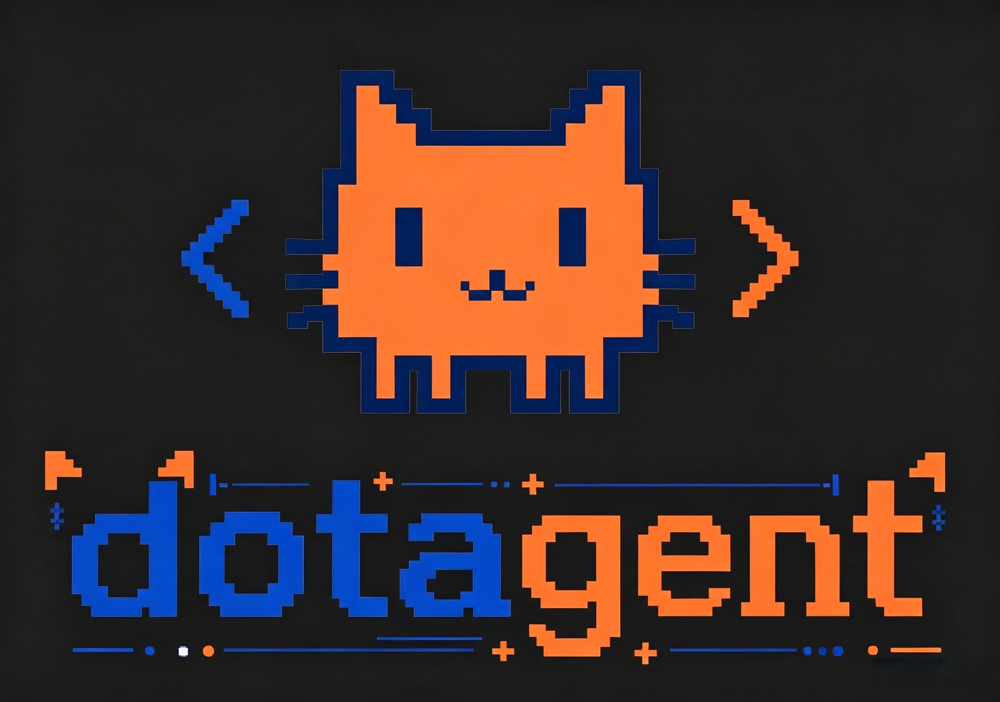

<p align="center">
  
</p>

<h1 align="center">dot_agent</h1>

<p align="center">
  从零开始搭建的多智能体 CodeAgent 系统，基于 LangGraph 实现 Agent 规划、工具调用、上下文压缩与结果验证的完整闭环。
</p>

---

## 项目概述

dot_agent 是从零开始自主开发的多智能体 CodeAgent 系统，完整实现了 Agent 规划、工具调用、上下文压缩、多轮记忆与结果验证的工程闭环。

项目的目标是构建一个真正可运行的 Agent 系统：从任务理解、计划制定、子 Agent 委派、工具执行到结果验证，每个环节都有清晰的实现和可控的行为边界。

## 核心特性

### 多智能体协作

基于 LangGraph StateGraph 构建 planner → searchAgent / codeAgent → verifier 的协作流水线：

- **planner**：分析任务、生成计划与 todo 列表，通过 JSON 路由决策（`route` + `route_instruction`）委派给专业 Agent
- **searchAgent**：调用 Tavily 执行网络搜索，返回研究摘要与来源链接
- **codeAgent**：读写文件、执行命令、更新 todo 进度、运行检查
- **verifier**：只读检查 workspace 文件与命令结果，判定任务是否完成
- **repair 循环**：verifier 失败时生成修复建议，路由到 repair 节点委派 codeAgent 修复，再回到 verifier 校验

### 上下文工程

- **双阈值压缩策略**：`soft_threshold=70%` 触发增量压缩（保留 20 条消息 + 叠加旧摘要），`hard_threshold=90%` 触发全量压缩（清空消息 + 保留 10 条 + 新摘要）
- **分级消息处理**：按消息重要性分为四级 — KEEP_ALWAYS → COMPRESS_LIGHTLY → COMPRESS_HEAVILY → DROP
- **持久化历史**：压缩前将完整消息追加写入 `RAW_HISTORY.md`，保留审计与重建能力

### 三层记忆系统

| 层级 | 内容 | 生命周期 |
| --- | --- | --- |
| `rules` | 用户自定义规则 | 跨任务持久化 |
| `working_memory` | 当前任务的关键信息 | 单任务内 |
| `history_summary_store` | 历史对话压缩摘要 | 跨轮次 |

支持记忆索引化与渐进式披露——启动时仅加载索引（~200 tokens），按需读取完整文件。

### 提示词动静分离

参考 Claude Code memory 文件模式，将提示词拆分为三层：

- **静态层**：`prompts/agent_prompt.py` 中的角色定义与规则模板
- **动态层**：`~/.mokioclaw/CLAUDE.md` + `.mokioclaw/config.md`（YAML frontmatter + markdown body），用户自定义指令自动注入所有 Agent 的 system prompt 末尾
- **运行时层**：task / plan / memory 由各节点通过 HumanMessage 在调用时注入

### 可靠性与工程化

- **检查点系统**：轻量模式保存状态摘要，严格模式保存完整 graph state；支持版本化快照枚举与 rollback 回退
- **钩子系统**：EventBus 实现 publish/subscribe 模式，内置 TUI 推送、CLI 打印、checkpoint 触发、trace 写入四个开箱即用的事件处理器
- **并行工具调度**：自动检测工具间文件级依赖，独立调用并行执行，TodoUpdate 强制串行避免竞态
- **安全机制**：路径遍历防护、高风险命令人工审批（inline/auto/deny 三模式）
- **双交互模式**：Rich CLI（单次任务事件时间线）与 Textual TUI（多轮对话全屏界面）

## 快速开始

### 环境配置

```bash
# 安装依赖
uv sync

# 配置 .env
cp .env_example .env
# 编辑 .env 填入 API_KEY / MODEL / BASE_URL / TAVILY_API_KEY
```

### 运行

```bash
# 单次任务（Rich CLI）
uv run dotagent "帮我查阅明日方舟阿米娅，并编写一个 HTML 介绍人物"

# 多轮对话（Textual TUI）
uv run dotagent tui

# 恢复中断的任务
uv run dotagent --resume .mokioclaw/workspaces/workspace-YYYYMMDD-HHMMSS-xxxxxx
```

### 测试

```bash
uv run pytest -q
```

## 用户自定义配置

dot_agent 支持两级用户配置，采用 YAML frontmatter + markdown body 格式：

```markdown
<!-- ~/.mokioclaw/CLAUDE.md 或 .mokioclaw/config.md -->
---
approval_mode: inline
max_attempts: 5
bash_timeout: 300
---

# Custom Instructions

以下指令会注入到所有 agent 的 system prompt 中：

- Always add type hints to Python code
- Use async/await for I/O operations
- Write tests for every new function
```

项目级配置覆盖全局配置的相同字段，markdown body 追加到 agent prompt 末尾。

详细说明见 [`.mokioclaw/config.md.example`](.mokioclaw/config.md.example)。

## 项目结构

```text
src/mokioclaw/
├─ interaction/          # 交互层：Rich CLI + Textual TUI
├─ orchestration/        # 编排层：LangGraph workflow + 节点实现
├─ agents/               # 专家 Agent：codeAgent / searchAgent
├─ tools/                # 工具层：Bash / File / Grep / WebSearch / Todo / Notepad
├─ memory/               # 记忆层：三层记忆 + 分级压缩 + 记忆索引
├─ state/                # 状态层：RuntimeState + GraphState
├─ reliability/          # 保障层：Checkpoint / Trace / Session / Parallel
├─ security/             # 安全层：路径校验 + 命令审批
├─ providers/            # 提供者层：LLM 模型抽象
├─ prompts/              # 提示词模板层（动静分离）
├─ core/                 # 基础设施：日志 / 路径 / 工具函数
├─ config/               # 用户配置加载器
└─ main.py               # 入口
```

## 技术栈

| 层面 | 选型 |
| --- | --- |
| LLM 编排 | LangChain + LangGraph |
| CLI 框架 | Typer + Rich |
| TUI 框架 | Textual |
| Web 搜索 | Tavily |
| 包管理 | uv + Hatchling |
| 测试 | pytest |

Python >= 3.13

## 文档

- [项目全景讲解](docs/project-overview.md)
- [实现完善报告](docs/IMPLEMENTATION_SUMMARY.md)
- [简历描述](docs/resume.md)
- [记忆系统快速参考](docs/MEMORY_QUICK_REFERENCE.md)


1. 这个和所有ai 和 用户 和 tool 调用等的message 应该在agent启动的时候 ，创建一个message list 存放这个 会话的所有message， 如果用户new 了一个session 自然需要清除数据， 所有和大模型 交互的 数据都应该放入到里面，在每一轮对话完毕持久化到 这个session 对话的turn_轮数的文件里面去， 这个turn_轮数 可以就保留这一轮的数据就好了， 如果用户rewind 轮数，就可以从这个 这个turn_0 到这个用户目标的轮数重新加载 message 进入到全局的message list中 用来恢复上下文，此外每轮保存turn的时候先 进行git保存，在进行turn_轮数保存 这个turn里面可以添加一个字段 git_commit_id 来标识这个 git 记录，用来项目的恢复 。
2 如果用户需要 resume 会话的话，比如cluade --rsume sesssion_xxxx 直接加载这个session_xxx 下面的所有turn_xx 的文件保留到全局的message list中，用来恢复上下文

3. 每轮对话都需要进行提示词的拼接， 但是项目里面有plan agent 这个应该不需要拼接啥提示词， 主要就是code agent ， 这个需要进行 提示词的动静分裂： 静态提示词：（用户偏好，反馈，还有类似于claude.md 的文件 + 系统工具说明）， 动态方面： skill 的描述， mcp 的所有工具的描述， skill 和mcp 都要渐进式纰漏， 一开始给system promt 放的都是简陋的， 比如mcp 的tool 只会存放函数name和函数描述，参数定义不会放，因为太多了占用提示词的token，导致token膨胀， skill也是一样的， 只给skill的name 和 skill 的skill.md 的desc部分， ai 返回的内容 类型规定可以为： type： mcp， skill，tool 如果是mcp 就根据mcp 的tool的name 找到这个函数的准确定义 再给ai，让他进行一次tool的调用， skill也是类型， 所以tool的调用你估计需要做一下 这个mcp 工具和系统工具的区分， 可以给mcp的工具添加统一前缀  mcp_xxxxx, 给大模型mcp tool name的时候可以加上mcp
   的前缀保持一致。 mcp 和skil的加载的路由和hook一样就好了
4. 项目的hook机制你做的很好 不需要改
5. 还有就是链路追踪这个问题， 我的意思是 在每轮的开始 构建一个大的traceId，后面每个调用都生成子traceId 这个 子traceId 可以递增 和时间戳一样， 需要让前端可以分析出来 这个trace链路， 参考那个sky wark那个链路追踪的 就好了，简易版本的就好了，每个链路可以保存的数据多一点，可以就是这个state的数据 再加上当前节点 + 调用时间长短 等元数据
6. 