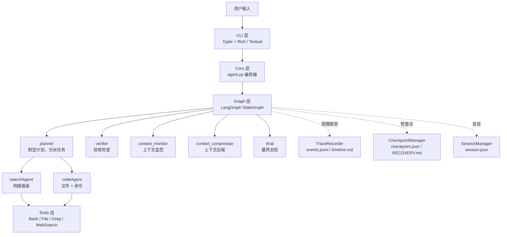
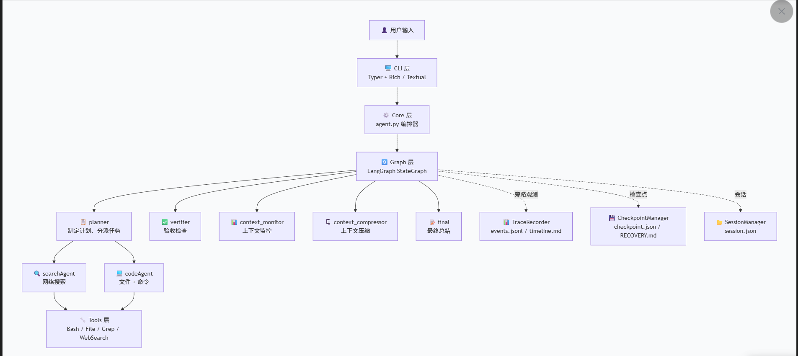
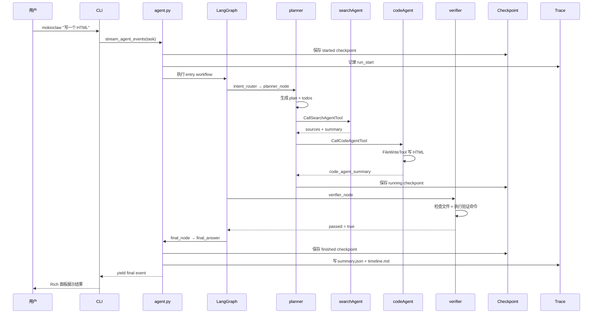
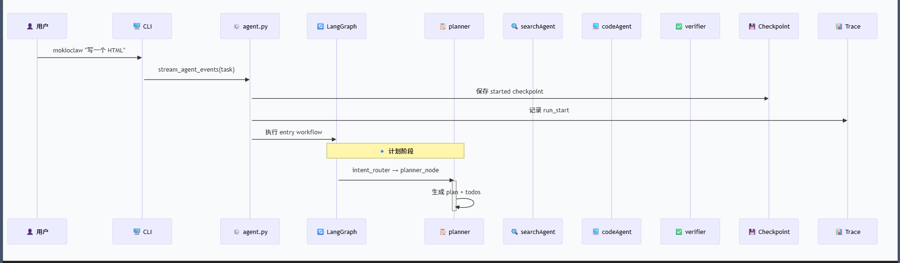
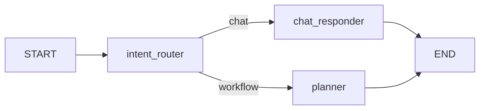
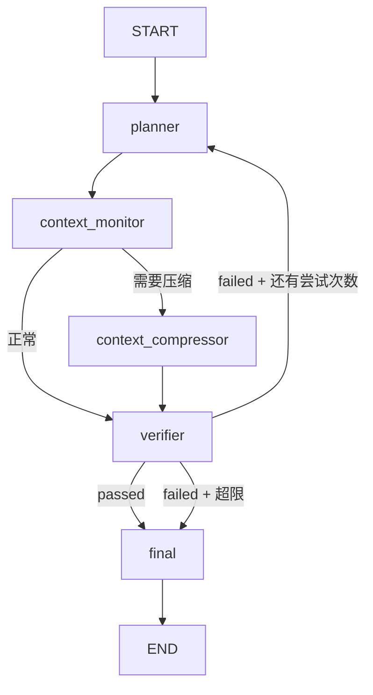
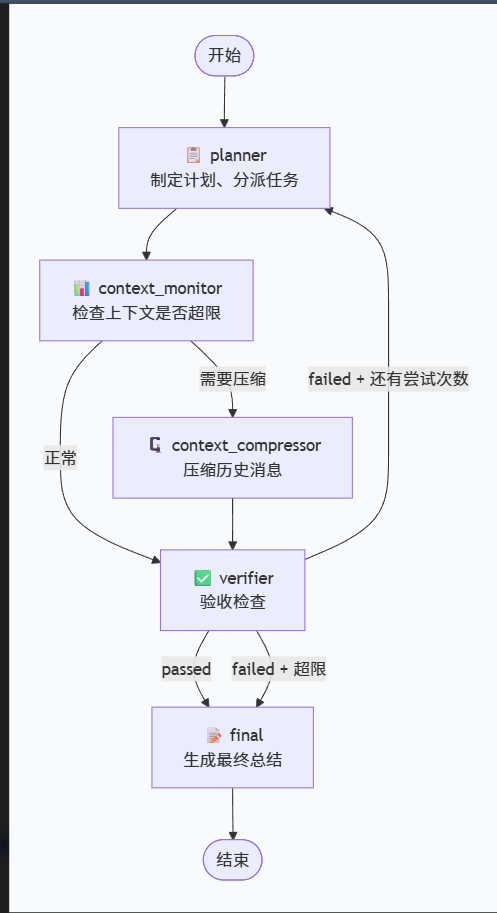

# MokioClaw 项目全景讲解

这篇文档从零开始讲解 MokioClaw 是什么、怎么跑起来的、每一层做了什么、模块之间怎么协作。

适合第一次接触这个项目的开发者，或者隔了一段时间回来需要快速回忆全貌的人。

## 一句话介绍

MokioClaw 是一个教学向的迷你 CodeAgent，从 ToolCall 到 Claw，展示了一个完整的 AI Agent 系统应该长什么样。

它不是框架，而是一个可以跑、可以改、可以拆开看的参考实现。

## 技术栈

| 层面 | 选型 | 说明 |
|------|------|------|
| LLM 编排 | LangChain + LangGraph | 模型调用、工具绑定、状态图工作流 |
| CLI 框架 | Typer | 命令行入口，参数解析 |
| 终端渲染 | Rich | 面板、表格、样式化文本输出 |
| TUI 框架 | Textual | 全屏终端 UI，多轮会话 |
| Web 搜索 | Tavily | searchAgent 的信息源 |
| 图片处理 | Pillow | TUI logo 半块字符渲染 |
| 环境配置 | python-dotenv | .env 加载 API_KEY / MODEL / BASE_URL |
| 包管理 | uv + Hatchling | 锁文件 + 构建系统 |

Python 版本要求：>= 3.13

## 顶层目录结构

```text
d:\code\ai\dot_agent\
├─ main.py                # 薄入口：import cli.app 然后调 app()
├─ pyproject.toml         # 项目元数据、依赖、CLI 入口点定义
├─ uv.lock                # 依赖锁文件
├─ .env                   # 运行时密钥（不进 git）
├─ .env_example           # .env 模板
├─ src/mokioclaw/         # 全部源码
├─ tests/                 # 测试套件
├─ docs/                  # 文档
└─ assets/                # 静态资源（logo PNG）
```

CLI 入口在 `pyproject.toml` 里注册：

```toml
[project.scripts]
mokioclaw = "mokioclaw.interaction.app:app"
```

安装后可以直接 `mokioclaw "你的任务"` 跑起来。

## 包结构总览

```text
src/mokioclaw/
├─ cli/                   # 命令行界面层
│  ├─ app.py              #   Typer 应用，两种模式：Rich / TUI
│  ├─ formatter.py        #   Rich 终端渲染器
│  ├─ event_summary.py    #   EventSummary 数据类（给 TUI 用）
│  └─ tui/
│     ├─ app.py           #   Textual 全屏 TUI 应用
│     ├─ approval.py      #   审批弹窗（线程间同步）
│     └─ logo.py          #   PNG 半块字符 logo 渲染
│
├─ core/                  # 核心运行时基础设施
│  ├─ agent.py            #   顶层编排器：stream_agent_events / stream_session_events
│  ├─ state.py            #   RuntimeState 数据类
│  ├─ approval.py         #   审批请求/决策 + 风险命令匹配
│  ├─ checkpoint.py       #   检查点管理：保存/恢复/git 快照
│  ├─ session.py          #   会话持久化：多轮对话管理
│  ├─ trace.py            #   追踪记录器：events.jsonl / summary.json / timeline.md
│  ├─ paths.py            #   路径工具：项目根目录、workspace 目录生成
│  └─ utils.py            #   共享工具函数
│
├─ graph/                 # LangGraph 工作流定义
│  ├─ workflow.py          #   构建两个 StateGraph（entry / complex）
│  ├─ nodes.py            #   所有节点实现（planner/verifier/context_monitor 等）
│  ├─ state.py            #   MokioGraphState TypedDict + 子类型
│  ├─ memory.py           #   三层记忆系统
│  └─ agent_loop.py       #   通用 agent 工具调用循环
│
├─ agents/                # 专家 Agent 实现
│  ├─ code_agent.py       #   codeAgent：文件操作 + 命令执行
│  └─ search_agent.py     #   searchAgent：网络搜索
│
├─ tools/                 # 工具实现
│  ├─ registry.py         #   工具注册表：构建工具列表
│  ├─ bash_tool.py        #   BashTool：安全 shell 执行
│  ├─ file_tools.py       #   文件读写编辑
│  ├─ grep_tool.py        #   正则搜索
│  ├─ notepad_tool.py     #   笔记本读写
│  ├─ todo_tool.py        #   待办事项管理
│  └─ web_search_tool.py  #   网络搜索（Tavily）
│
├─ prompts/               # LLM 提示词模板
│  ├─ agent_prompt.py     #   6 个核心 prompt
│  ├─ context_manager_prompt.py  # 上下文压缩 prompt
│  └─ simple_agent_prompt.py     # 旧版 prompt（遗留）
│
└─ providers/             # 模型提供者抽象
   └─ openai_provider.py  #   create_model()：从 .env 构建 ChatOpenAI
```

## 总体架构图






## 一次任务的完整流程

从用户敲下命令到看到结果，中间发生了什么：

```text
用户输入: mokioclaw "帮我写一个 HTML 页面"
    │
    ▼
┌─ CLI 层 ─────────────────────────────────────────────────┐
│  app.py 解析参数，创建 RuntimeState                        │
│  调用 core/agent.py 的 stream_agent_events()              │
└──────────────────────────────────────────────────────────┘
    │
    ▼
┌─ Entry Workflow ─────────────────────────────────────────┐
│  intent_router 分类：这是聊天还是任务？                     │
│  ├─ 聊天 → chat_responder 直接回复，结束                   │
│  └─ 任务 → 进入 Complex Workflow                          │
└──────────────────────────────────────────────────────────┘
    │
    ▼
┌─ Complex Workflow ───────────────────────────────────────┐
│                                                           │
│  planner_node                                             │
│  ├─ 构建三层记忆（rules + working_memory + history）       │
│  ├─ 生成计划、todos、验收标准、验证命令                      │
│  ├─ 调用 searchAgent 搜索资料                              │
│  ├─ 调用 codeAgent 写文件、跑命令                          │
│  └─ 更新 TODO.md                                          │
│         │                                                 │
│         ▼                                                 │
│  context_monitor_node                                     │
│  ├─ 估算 token 数                                         │
│  ├─ 超限 → context_compressor 压缩上下文                   │
│  └─ 正常 → 继续                                           │
│         │                                                 │
│         ▼                                                 │
│  verifier_node                                            │
│  ├─ 用只读工具检查 workspace 文件                          │
│  ├─ 执行验证命令                                           │
│  ├─ 返回 JSON 判定：passed / failed                        │
│  └─ 失败且未超最大尝试数 → 回到 planner 重试                │
│         │                                                 │
│         ▼                                                 │
│  final_node                                               │
│  └─ 生成最终总结，输出给用户                                │
│                                                           │
└──────────────────────────────────────────────────────────┘
    │
    ▼
┌─ 旁路系统（全程并行运行）────────────────────────────────┐
│  CheckpointManager → checkpoint.json + RECOVERY.md        │
│  TraceRecorder → events.jsonl + summary.json + timeline.md│
│  SessionManager → session.json（TUI 多轮模式）             │
└──────────────────────────────────────────────────────────┘
```

## 时序图







## 各层详解

### CLI 层：用户看到的第一层

CLI 层负责两件事：接收用户输入、渲染输出。

**两种运行模式：**

| 模式 | 命令 | 渲染方式 | 适用场景 |
|------|------|----------|----------|
| Rich 模式 | `mokioclaw "任务"` | Rich Panel/Table 直接打印到终端 | 单次任务、脚本集成 |
| TUI 模式 | `mokioclaw tui` | Textual 全屏界面 | 多轮对话、交互式探索 |

**Rich 模式的工作方式：**

```text
app.py main()
  → stream_agent_events() 返回事件生成器
  → 逐个 event 调用 formatter.print_event()
  → print_event() 根据 event.type 分发到对应 render 函数
  → render 函数用 Rich Panel/Table/Text 输出到终端
```

**TUI 模式的工作方式：**

```text
MokioClawTuiApp 启动
  → 后台工作线程调用 stream_session_events()
  → 工作线程通过 AgentEventMessage 投递事件到主线程
  → 主线程用 event_summary.summarize_event() 转为 EventSummary
  → TUI 组件根据 EventSummary 更新界面
  → 用户在输入框输入下一轮任务，循环继续
```

**TUI 的线程模型：**

```text
┌─ 主线程（Textual UI 循环）─────────────────────┐
│  接收 AgentEventMessage → 更新事件流区域         │
│  接收 ApprovalRequestedMessage → 弹出审批弹窗    │
│  用户输入 → 投递 UserInputMessage 到工作线程      │
└────────────────────────────────────────────────┘
        ↑ Message 投递              ↓ Message 投递
┌─ 工作线程（Agent 执行）─────────────────────────┐
│  stream_session_events() 生成事件                │
│  遇到审批 → 创建 ApprovalGate，投递消息后 wait() │
│  收到 UserInputMessage → 继续下一轮              │
└────────────────────────────────────────────────┘
```

**formatter.py vs event_summary.py：**

两者处理相同的事件类型，但输出格式不同：

| 模块 | 输出 | 用途 |
|------|------|------|
| formatter.py | `Console.print(Panel(...))` | Rich 模式，直接打印到终端 |
| event_summary.py | `return EventSummary(...)` | TUI 模式，返回结构化数据给组件 |

### Core 层：运行时的骨架

Core 层是整个系统的基础设施，不涉及 AI 逻辑，只管"怎么跑"。

#### agent.py — 顶层编排器

这是整个系统的入口点。CLI 调用它，它驱动一切。

两个核心生成器：

```python
# 单次执行
def stream_agent_events(task, ...) -> Generator[dict]:
    # 1. 创建 RuntimeState
    # 2. 初始化 Checkpoint + Trace
    # 3. 运行 entry workflow（意图路由）
    # 4. 如果是 workflow → 运行 complex workflow
    # 5. 产出事件给调用方
    # 6. 清理：保存最终 checkpoint，写 trace summary

# 多轮会话（TUI 用）
def stream_session_events(task, ...) -> Generator[dict]:
    # 1. 加载或创建 session
    # 2. 追加 user turn
    # 3. 调用 stream_agent_events()
    # 4. 追加 assistant turn
    # 5. 保存 session
```

#### state.py — RuntimeState

运行时状态容器，贯穿整个执行过程：

```python
@dataclass
class RuntimeState:
    workspace: Path              # workspace 目录路径
    read_files: dict             # 文件快照（防并发修改）
    approval_mode: str           # inline / auto / deny
    approval_handler: Callable   # 审批回调函数
    bash_timeout_seconds: int    # 命令超时
    bash_max_output_chars: int   # 输出截断长度
    checkpoint_mode: str         # light / strict / off
    trace_mode: str              # on / off
    # ...
```

关键安全方法：`assert_workspace_path()` 防止路径穿越攻击。

#### approval.py — 审批系统

当 BashTool 检测到危险命令时，需要人工审批：

```text
1. BashTool 收到命令
2. classify_command_risk() 匹配风险模式
3. 匹配到 → 创建 ApprovalRequest（含 UUID）
4. 根据 approval_mode 决定行为：
   - auto: 自动批准
   - deny: 自动拒绝
   - inline: 弹出审批界面等待用户决定
5. 返回 ApprovalDecision（approved + reason）
```

风险模式示例：`pip install`、`npm install`、`curl`、`wget`、`uvicorn` 等。

#### checkpoint.py — 检查点管理

两种模式：

| 模式 | 保存内容 | 恢复方式 |
|------|----------|----------|
| light | checkpoint.json + RECOVERY.md + git 快照 | 读取恢复文档，重新进入 workflow |
| strict | 额外保存 state.json + events.jsonl | 尝试反序列化 state，失败则降级 light |
| off | 不保存 | 不可恢复 |

检查点在以下时机保存：开始运行、graph 更新、失败/审批类工具结果、中断（Ctrl+C）、结束。

#### session.py — 会话持久化

TUI 多轮模式专用。管理 `.mokioclaw/session/session.json`：

- 自动压缩：保留最近 18 轮，更早的轮次压缩为摘要
- 生成 `SESSION_SUMMARY.md` 供人类阅读
- `build_session_context()` 构建紧凑 JSON 上下文给 LLM

#### trace.py — 追踪记录器

旁路观测系统，不影响主流程：

```text
.mokioclaw/traces/trace-YYYYMMDD-HHMMSS-xxxxxx/
├─ events.jsonl      # 每个事件的结构化日志（带序列号、时间戳、耗时）
├─ summary.json      # 汇总统计（节点访问次数、工具调用数、失败数等）
└─ timeline.md       # 人类可读的时间线（长任务会截断中间部分）
```

Trace 和 Checkpoint 的区别：
- **Checkpoint** 为了恢复任务，回答"中断后怎么继续"
- **Trace** 为了观测任务，回答"这次运行发生了什么"

### Graph 层：AI 工作流的大脑

Graph 层定义了 Agent 的思考和行动流程，用 LangGraph 的 StateGraph 实现。

#### state.py — MokioGraphState

整个工作流的共享状态，约 40 个字段：

```python
class MokioGraphState(TypedDict):
    # 任务核心
    task: str
    plan_summary: str
    todos: list[TodoItem]
    acceptance_criteria: list[str]
    verification_commands: list[str]

    # 验证循环
    passed: bool
    attempts: int
    max_attempts: int
    verification_checks: list[VerificationCheck]

    # 意图路由
    intent_route: str          # "chat" 或 "workflow"
    chat_response: str

    # 上下文管理
    context_token_count: int
    context_should_compress: bool
    history_summary: str

    # Agent 交互
    agent_handoffs: list[AgentHandoff]
    code_agent_summary: str
    sources: list[SourceItem]

    # 消息
    messages: Annotated[list, add_messages]
    final_answer: str
```

#### workflow.py — 两个 StateGraph

**Entry Workflow（入口路由）：**



意图路由器把用户输入分类为"聊天"（轻量问答）或"任务"（需要编排的 coding task）。

**Complex Workflow（主工作流）：**






这是一个带重试的循环：planner 做计划 → verifier 验收 → 失败则 planner 重来。

#### nodes.py — 节点实现

每个节点是一个函数，接收 state 返回 state 更新：

**planner_node（核心节点）：**
- 构建三层记忆
- 绑定 3 个工具：TodoWriteTool、CallSearchAgentTool、CallCodeAgentTool
- 运行工具调用循环（最多 8 轮）
- 创建/更新计划，分派子 Agent

**verifier_node：**
- 绑定只读工具（FileRead、Grep、Bash、WebSearch）
- 检查 workspace 文件
- 执行验证命令
- 返回 JSON 判定：`{passed, reason, checks, recommended_next_instruction}`

**context_monitor_node：**
- 估算当前消息的 token 数
- 超过阈值（默认 400K）→ 路由到 compressor

**context_compressor_node：**
- 调用 LLM 压缩消息历史
- 保留任务状态、计划、发现、来源
- 持久化到 HISTORY_SUMMARY.md

**final_node：**
- 汇总所有信息生成最终答案
- 包含：状态、计划、todos、来源、验收结果、压缩统计

#### memory.py — 三层记忆系统

MokioClaw 不把所有信息都塞进 messages，而是分层存放：

```text
┌─ Rules 层（静态）─────────────────────────┐
│  workspace 约束、行为准则                    │
│  来自 prompt 模板，不随任务变化              │
└──────────────────────────────────────────┘

┌─ Working Memory 层（动态）─────────────────┐
│  task / plan / todos / sources             │
│  handoffs / research_notes / last_error    │
│  来自 state 字段，每步更新                  │
└──────────────────────────────────────────┘

┌─ History Summary Store 层（压缩）──────────┐
│  HISTORY_SUMMARY.md 内容                   │
│  NOTEPAD.md 内容                           │
│  context_summary / compression_events      │
│  上下文压缩后保留的长期记忆                  │
└──────────────────────────────────────────┘
```

`build_layered_memory()` 从 state + 文件中组装三层，`format_layered_memory_for_prompt()` 序列化为 JSON 给 LLM。

### Agents 层：专家 Agent

两个专职 Agent，各有自己的 prompt、工具集和循环：

#### codeAgent（code_agent.py）

职责：写文件、跑命令、更新 todo。

```python
def run_code_agent(state, instruction, writer, max_loops=10):
    # 绑定工具：FileRead, FileWrite, FileEdit, Grep, Bash,
    #          NotepadRead, NotepadAppend, TodoUpdate
    # 运行工具调用循环
    # 返回 {ok, summary, todos, messages, tool_events}
```

#### searchAgent（search_agent.py）

职责：网络搜索、收集资料。

```python
def run_search_agent(state, instruction, writer, max_loops=4):
    # 绑定工具：WebSearch
    # 运行搜索循环
    # 去重来源
    # 返回 {ok, summary, queries, sources, messages, tool_events}
```

#### Agent 调用方式

planner 不是直接调用 Agent 函数，而是通过工具调用：

```text
planner 的工具列表包含 CallSearchAgentTool 和 CallCodeAgentTool
planner 的 LLM 决定"我需要搜索" → 产出 tool_call: CallSearchAgentTool(instruction="...")
Graph 层捕获 tool_call → 执行 run_search_agent()
结果作为 ToolMessage 返回给 planner
```

这种设计让 planner 的 LLM 自己决定什么时候需要专家帮助。

### Tools 层：Agent 的手和脚

#### 工具注册表（registry.py）

两套工具集：

| 工具集 | 用途 | 包含的工具 |
|--------|------|-----------|
| `build_tools()` | codeAgent | FileRead, FileWrite, FileEdit, Grep, Bash, NotepadRead, NotepadAppend |
| `build_read_only_tools()` | verifier | FileRead, Grep, Bash, NotepadRead, WebSearch |

#### BashTool（bash_tool.py）— 最复杂的工具

BashTool 不只是"执行命令"，它有一整套安全和环境管理机制：

```text
run_bash(state, command, timeout_seconds, run_in_background)
    │
    ├─ 1. 危险命令拦截
    │     rm -rf /、format、shutdown 等 → 直接拒绝
    │
    ├─ 2. 风险命令审批
    │     pip install、curl 等 → 走审批流程
    │
    ├─ 3. 环境准备
    │     ├─ _ensure_toolchain_shims() → 创建 python/pip shims
    │     ├─ PATH 前置：.venv + shims + node_modules/.bin
    │     └─ 平台适配：Windows cmd vs POSIX shell
    │
    ├─ 4. 执行
    │     ├─ 超时控制
    │     ├─ 输出捕获
    │     └─ 后台模式（run_in_background=true）
    │
    └─ 5. 输出处理
          ├─ 截断到 bash_max_output_chars
          ├─ 超限 → 写到 .mokioclaw/bash-outputs/
          └─ 返回 {ok, stdout, stderr, exit_code, ...}
```

Shims 目录解决了"Agent 运行 pip install 装到了系统 Python，但后面 python app.py 用的是另一个 Python"的问题。

#### 文件工具（file_tools.py）

三个工具都有路径安全检查：

- `resolve_workspace_path()`：去掉 `workspace/` 前缀，确保路径在 workspace 内
- `read_file()`：多编码支持（utf-8, gbk），记录 FileSnapshot
- `write_file()`：要求先读再写，检查 mtime 防并发修改，返回 unified diff
- `edit_file()`：精确文本替换，要求唯一匹配

#### 其他工具

| 工具 | 功能 |
|------|------|
| grep_tool.py | 正则搜索 workspace 文件，跳过 .git/.venv/__pycache__ |
| notepad_tool.py | 读写 NOTEPAD.md，存活于上下文压缩的长期笔记 |
| todo_tool.py | 管理 TODO.md：计划、todos、验收标准、验证命令 |
| web_search_tool.py | Tavily API 网络搜索，返回 title/url/content/score |

### Prompts 层：给 LLM 的指令

所有 prompt 集中在 `prompts/agent_prompt.py`：

| Prompt | 用途 | 特点 |
|--------|------|------|
| PLANNER_PROMPT | 协调者角色 | 指导如何使用 TodoWrite/CallSearchAgent/CallCodeAgent |
| SEARCH_AGENT_PROMPT | 搜索专家 | 只能用 WebSearchTool |
| CODE_AGENT_PROMPT | 实现专家 | 文件/命令/笔记工具 + todo 管理规则 |
| VERIFIER_PROMPT | 验收检查员 | 只读检查，必须返回原始 JSON 判定 |
| INTENT_ROUTER_PROMPT | 意图分类器 | 区分 chat/workflow，带置信度 |
| CHAT_RESPONDER_PROMPT | 聊天回复器 | 轻量问答，不用工具 |

`context_manager_prompt.py` 包含 `CONTEXT_COMPRESSION_PROMPT`，指导 LLM 压缩上下文。

关键设计：prompt 里明确要求"Return ONLY a raw JSON object. Do NOT wrap it in markdown code fences"，避免 LLM 返回被 markdown 包裹的 JSON。

### Providers 层：模型抽象

`providers/openai_provider.py` 只做一件事：

```python
def create_model() -> ChatOpenAI:
    # 从 .env 读取 API_KEY, MODEL, BASE_URL
    # 返回 ChatOpenAI(temperature=0)
```

所有节点和 Agent 都通过这个函数获取模型实例。

## 模块依赖关系

从上到下的调用链：

```text
cli/app.py
  └→ core/agent.py
       ├→ core/checkpoint.py
       ├→ core/session.py
       ├→ core/trace.py
       ├→ core/state.py
       └→ graph/workflow.py
            └→ graph/nodes.py
                 ├→ agents/code_agent.py
                 │    ├→ tools/ (build_tools)
                 │    ├→ graph/memory.py
                 │    └→ prompts/agent_prompt.py
                 ├→ agents/search_agent.py
                 │    ├→ tools/web_search_tool.py
                 │    └→ prompts/agent_prompt.py
                 ├→ graph/memory.py
                 ├→ prompts/agent_prompt.py
                 ├→ prompts/context_manager_prompt.py
                 ├→ providers/openai_provider.py
                 └→ tools/ (build_read_only_tools)
```

横切关注点（被多处引用）：

```text
core/utils.py        ← 几乎所有模块都用
core/approval.py     ← bash_tool.py, cli/app.py, cli/tui/approval.py
core/state.py        ← graph/nodes.py, agents/*, tools/*
graph/state.py       ← graph/nodes.py, agents/*, graph/memory.py
providers/openai_provider.py ← graph/nodes.py, agents/*
```

## 核心设计模式

### 1. 多 Agent 编排

不是所有事情都让一个 Agent 做。planner 负责协调，searchAgent 负责搜索，codeAgent 负责实现。

关键是：planner 通过**工具调用**（而非直接函数调用）来驱动子 Agent。这让 LLM 自己决定什么时候需要什么帮助。

### 2. 三层记忆

上下文不是越长越好，而是要放在正确的位置：

- **Rules**：不变的行为准则，每次都有
- **Working Memory**：当前任务的动态状态，每步更新
- **History Summary**：压缩后的长期记忆，上下文溢出时才触发

### 3. Harness Engineering

Agent 不只是模型调用，外面的运行壳同样重要：

- BashTool 的 shims 稳定工具链
- 审批系统控制危险操作
- 检查点让中断后可以继续
- Trace 让运行过程可追溯

### 4. 事件驱动架构

所有节点交互都产出结构化事件，由渲染层消费：

```text
graph/nodes.py 产出事件 → core/agent.py yield 事件
  → cli/formatter.py 渲染到终端（Rich 模式）
  → cli/event_summary.py 转为 EventSummary（TUI 模式）
```

同一个事件流，两种渲染方式，互不干扰。

## Workspace 目录结构

一次运行后，workspace 长这样：

```text
workspace-YYYYMMDD-HHMMSS-xxxxxx/
├─ TODO.md                          # 工作记忆：计划、todos、验收标准
├─ NOTEPAD.md                       # 长期笔记（如果 Agent 写了的话）
├─ HISTORY_SUMMARY.md               # 压缩后的历史摘要（如果触发了压缩）
├─ <实际产出的文件，例如 app.py, index.html>
│
└─ .mokioclaw/
   ├─ checkpoints/
   │  ├─ checkpoint.json             # 程序读取的结构化检查点
   │  ├─ RECOVERY.md                 # 人类可读的恢复文档
   │  └─ git/                        # workspace 文件的 git 快照
   │
   ├─ traces/
   │  └─ trace-YYYYMMDD-HHMMSS-xxxxxx/
   │     ├─ events.jsonl             # 结构化事件日志
   │     ├─ summary.json             # 汇总统计
   │     └─ timeline.md              # 人类可读时间线
   │
   ├─ session/                       # TUI 模式的会话持久化
   │  └─ session.json
   │
   ├─ shims/                         # python/pip 稳定快捷方式
   │  ├─ python
   │  ├─ python3
   │  ├─ pip
   │  └─ pip3
   │
   ├─ bash-outputs/                  # 长命令输出落盘
   └─ background/                    # 后台服务输出
```

## 快速上手

### 安装

```bash
# 克隆项目
git clone <repo-url>
cd dot_agent

# 用 uv 安装（推荐）
uv sync

# 或者用 pip
pip install -e .
```

### 配置

复制 `.env_example` 为 `.env`，填入：

```text
API_KEY=your-api-key
MODEL=gpt-4o
BASE_URL=https://api.openai.com/v1
TAVILY_API_KEY=your-tavily-key
```

### 运行

```bash
# Rich 模式（单次任务）
mokioclaw "帮我写一个 Hello World 的 Python 脚本"

# TUI 模式（多轮对话）
mokioclaw tui

# 恢复中断的任务
mokioclaw --resume <workspace-path>

# 查看帮助
mokioclaw --help
```

## 文件索引

| 文件 | 用途 |
|------|------|
| `docs/workspace-lifecycle.md` | 一次真实任务的完整链路拆解 |
| `docs/project-overview.md` | 本文档：项目全景讲解 |
| `cli/README.md` | CLI 层详细文档（Typer/Rich/Textual 框架讲解） |
