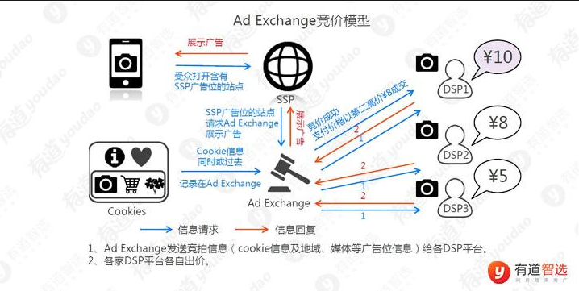

# IAA 和 IAP
IAA：用户在 App 内直接花钱，用真实货币购买虚拟商品、会员、订阅、道具的付费体系，就是你前面提到的三方支付（Antom/Stripe/PayPal）对接的核心业务。


IAP：不靠用户付费，靠在 App 里展示广告，向广告主收钱变现，用户不用花钱，看广告换福利。
- 收入来源：广告平台（Meta、AdMob、Unity Ads 等）结算，和支付服务商无关


# 广告投放类型

信息流广告
搜索广告
种草广告

# 广告三角色

DSP（需求方平台） 是买家（代表广告主）

SSP（供应方平台） 是卖家（代表媒体/网站， 提供广告位的平台（比如抖音、快手等））

Ad Exchange（广告交易平台） 是交易所（撮合交易的地方）： 它负责将DSP和SSP连接起来，实现广告的实时竞价和展示。

SSP和DSP是站在“河”两端的“两岸”，而ADX是架在河上的“桥”。

## 角色交互过程

结合我们之前聊的知识，这个广告位的运作可以完美对应起来：

1. DSP（需求方平台）：《凡人修仙传》的广告主（比如游戏或动画的制作方）通过DSP平台，设置好目标人群（可能就是你这类喜欢国漫、修仙题材的用户）、预算和出价策略，来参与这个广告位的竞争。

2. SSP（供应方平台）：B站作为媒体方，通过其SSP平台，将“B站App首页顶部的Swiper广告位”这个流量资源拿出来售卖。这个广告位正是B站效果广告中的一个重要资源位。

3. ADX（广告交易平台）：当你的App打开时，ADX就会发起一次实时竞价。所有想投这个Swiper位置的DSP（包括《凡人修仙传》的）会同时出价，出价最高且最匹配你画像的广告，就会被展示给你。

简单来说，B站是“房东”（SSP端），《凡人修仙传》的广告主是“租客”（DSP端），ADX就是撮合你们快速成交的“中介平台”。你每次看到这个Swiper，背后都是一场发生在毫秒间的“三方协作”。

# 广告实时拍卖流程

1. 当你打开一个App或网页时，背后正在发生一场“闪电战”：

2. 发起请求：你打开App，App内的广告位（由SSP管理）瞬间向广告交易平台（ADX）发出信号：“我有一个广告位空出来了，用户是某个城市的年轻女性，谁要投广告？”

3. 发起竞价：ADX将这个信息广播给多家DSP。

4. 分析出价：各家DSP迅速分析这个用户是否符合其广告主的目标人群，并在几十毫秒内给出一个出价（比如DSP-A出价1.2元，DSP-B出价1.0元）。

5. 成交展示：ADX选出出价最高者（DSP-A），通知SSP，将DSP-A的广告展示在你面前。

6. 费用结算：整个过程闪电完成，广告主的预算被扣费，媒体获得收入。

## b站广告实时拍卖流程实例

1. 用户打开B站App，触发广告请求
   你像往常一样打开B站App，首页顶部的Swiper广告位被加载。此时，这个广告位是“空”的，急需填充一个广告内容。

2. B站的SSP发出“寻人启事”（Bid Request）
   B站作为媒体方，其内部的SSP立即将这个广告位的信息打包成一个竞价请求，发送给连接的ADX（广告交易平台）。这个请求里包含了关键信息：

- 广告位信息：B站App首页顶部、尺寸、是轮播图。

- 用户画像（脱敏）：比如“用户ID-xxx，性别男，18-25岁，近期看过《凡人修仙传》动画、国漫标签重度用户、iOS设备、上海”。

3. ADX向多家DSP广播“机会来了”
   ADX收到请求后，会把这个机会同时广播给所有接入它的DSP（比如巨量引擎、腾讯广告、The Trade Desk等）。广播内容包含广告位信息和脱敏后的用户画像。

4. 各DSP“闪电估价”并出价
   在几十毫秒内，接入ADX的各个DSP开始并行工作，各自独立计算：

- DSP-《凡人修仙传》游戏：算法一看，“这个用户和我目标人群完美重合！”。迅速计算出一个最高出价（封顶价）：1.5元，报给ADX。

- DSP-某运动饮料：算法判断“这个用户是年轻男性，和运动人群有重合但匹配度一般”。计算出出价0.5元，报给ADX。

- DSP-某奢侈品：算法判断“18-25岁男性，不太可能是我的目标客户”。直接放弃，不出价。

此时，所有DSP都在毫秒内独立、密封地报出了自己的“心理价位”。

5. ADX“落锤”：价高者得，但付第二名的钱
   ADX收集齐所有DSP的报价后，进行比价：

- 出价最高者：DSP-《凡人修仙传》游戏（1.5元）

- 第二名：DSP-某运动饮料（0.5元）

ADX判定DSP-《凡人修仙传》游戏赢得这次展示权。根据程序化广告通用的第二价格密封拍卖（GSP）机制：

- 赢家实际支付金额 = 0.5元（第二名出价） + 0.01元 = 0.51元。

- 比自己的封顶价（1.5元）省了将近1块钱。

6. 广告展示到你面前，同时数据回传
- ADX将获胜结果通知B站的SSP，并将《凡人修仙传》游戏的广告素材（图片/动图）传送过来。

- 最终，《凡人修仙传》的广告以轮播图的形式，展示在你B站首页的顶部。

- 同时，DSP会收到一条“曝光成功”的回传数据，用于后续的投放效果分析和模型优化（比如记录这次花了0.51元买到了一次展示）

## dsp角色

DSP平台本质上是一个需求方自动化平台。当广告主在DSP上设置好一个广告活动后，比如：

- 目标人群：25-35岁，上海，喜欢科技产品的男性
- 出价策略：最高出价2元，目标转化成本不超过50元
- 投放预算：每天总预算5000元
- 设置完成后，一切就交给机器了。DSP的服务器会7x24小时不间断地、持续地监听来自各个广告交易平台（ADX）发来的竞价请求。每个请求都是一次潜在的广告展示机会。整个过程完全由代码和算法驱动，没有任何人工干预。

### 竞价决策

“DSP 在计算看到广告位的用户的个人画像值多少钱，进而跟 SSP 进行竞价。”

- “用户的个人画像值多少钱” 👉 更专业的说法是：“预估这个用户对我广告主的商业价值（eCPM，即千次展示期望收入）”。它包含了用户画像，但最终结果是算出一个具体的“出价金额”。

- “跟 SSP 进行竞价” 👉 更精确的说法是：“通过 ADX（广告交易平台）跟其他 DSP 竞价”。

当DSP的服务器收到一个竞价请求（Bid Request）时，它需要在极短的时间（通常50-100毫秒内） 做出判断。这个决策流程就像一场发生在瞬间的闪电战：

1. 瞬间“查户口”（用户画像匹配）：DSP首先会查看这个请求附带的用户信息，比如地理位置、设备类型、近期浏览行为等，然后迅速与广告主设定的目标人群进行比对。如果匹配度高，就进入下一步；如果不匹配，就直接放弃，不参与出价。

2. 瞬间“估值”（预估点击率与转化率）：如果用户匹配，DSP内置的机器学习模型会立刻计算两个关键概率：

- 预估点击率：这个用户看到广告后，有多大可能性会点击？

- 预估转化率：点击广告后，有多大可能性会完成购买等目标行为？

3. 瞬间“出价”（计算最优价格）：最后，DSP会根据预估的价值，结合广告主设定的预算和出价策略，计算出一个最优的出价。出价通常不是固定的，而是动态计算的，比如系统判断这个用户价值很高，可能会出1.5元；如果觉得价值一般，可能只出0.5元，甚至放弃。

- DSP计算出的出价，完全是根据广告主在后台的配置实时计算出来的。
- 目标A：追求转化量（如购买、下载）：算法会拼命帮你花完预算，尽可能多地获取转化，不太在意单个转化的成本高低。此时算法会计算出价偏高一些，以确保能抢到更多流量。
- 目标B：控制转化成本（如期望成本50元/单）：算法会精打细算，把每次成交的成本尽量控制在50元以内，哪怕因此放弃一些高价的流量。此时算法会根据当前成本动态调整出价，成本高了就降低出价，成本低了可以尝试加价抢更多好流量。

### dsp的任务

数据上报-模型训练-优化出价”的闭环任务
机器学习算法模型，就是这些DSP平台自身提供的核心服务。

DSP（需求方平台）的本质就是帮助广告主花最少的钱买到最合适的流量。要实现这一点，就必须有“出价算法”和“数据闭环”：

- 数据上报：广告展示后有没有被点击、有没有人下单，这些转化数据都由广告主的代码（监控像素或SDK）直接回传给DSP。DSP拿到这些“结果标签”，才能知道自己之前花1.2元买这个用户亏了还是赚了。

- 模型训练：DSP用这些回传的真实转化数据，每天夜里训练自己的出价模型（CTR/CVR预估模型）。

- 优化出价：第二天，这个进化后的模型上线，让DSP在下次竞价时，能更精准地判断“这个用户值多少钱”，从而用最优价格去抢流量。

一句话总结：这个闭环直接影响“花多少钱”和“买什么样的人”，这是广告主（DSP端）最核心的商业机密和竞争力，DSP必须自己做。

### dsp平台的使用

对于DSP平台来说，提供强大的机器学习能力，就像汽车厂商必须提供发动机一样，是它们立足的根本。你作为广告主，不需要自己去写代码、调参数、建模型，平台已经把这些复杂的工作封装好了。

当你使用DSP平台时，你只需要做几件简单的事：

1. 设定目标：告诉系统你想要什么，是“更多点击”还是“更多购买”（优化目标）。

2. 上传素材：把你的广告图片或视频上传上去。

3. 设定预算：告诉系统你打算花多少钱。

做完这三步，点击“开始投放”，背后的机器学习引擎就自动运转起来了。它会自动完成我们之前聊到的所有工作：分析用户、预估价值、自动出价、实时优化。


### 管理后台对接DSP系统
1. 1️⃣ 数据看板（给老板和运营看）
- 实时监控：制作一个专属大屏，实时滚动显示“今日花费”、“各渠道ROI”、“Top 10 创意表现”，比DSP自带的后台更符合你公司的决策习惯。

- 趋势分析：用折线图展示近7天/30天的转化成本变化，快速发现异常波动。

2. 2️⃣ 归因与深度分析（给优化师看）
- 多维度交叉分析：不只看“花了多少钱”，还能拆解出 “哪个时间段来的用户最终下单最多？”、“看过哪个视频的用户退货率最低？”

- 自定义归因窗口：比如你卖的是高客单价的课程，用户可能需要考虑一周才下单。你可以设置一个7天归因窗口，自行计算“点击后7天内的所有转化”，而不依赖DSP的默认模型。

3. 3️⃣ 数据回灌与模型调优（给算法工程师看）
这是最有价值、也最专业的一环：

- 将后端清洗好的数据（比如“哪些用户实际付费了”）再传回DSP。

- DSP的算法在学习到这些 “真实转化” （而不是“虚假点击”）数据后，会迅速调整出价策略，帮你找到更多高价值用户。这是一个 “用你自己的后端数据，去优化DSP为你出价” 的超级循环。


#### 开发的接口
开发模块	        作用	                                                            技术实现要点


曝光/点击接收端	接收DSP回传的每一次曝光和点击的原始数据（包含设备ID、时间戳、素材ID等）。	一个高并发的HTTP接口，能承受每秒数万次的请求。

归因与拼接服务	将“点击数据”与“你自己业务系统的转化数据（比如用户注册/下单）”进行关联，判断这笔订单是哪个广告带来的。	                     基于设备ID或用户ID进行Join操作，写入数据库。


# 广告投放流程

## 提供广告位

### 接入流程

图片：


### 一、先分清两边角色（别搞反）

1. **你（APP 开发者）= 卖方（供给侧）→ 用 SSP**
   手里有广告空位（开屏、激励视频、信息流），要把空位卖掉赚钱。
   SSP 就是专门给媒体卖广告位的工具。
2. **APP 投放广告拉新的老板 = 买方（需求侧）→ 用 DSP**
   手里有预算，想买用户曝光、买安装，去竞价抢你的广告位。

### app公司 接入ssp平台流程

1. 注册 SSP 平台（字节穿山甲、腾讯优量汇、百度 SSP 等），上传你的 APP、创建广告位，拿到 SDK；
2. 开发集成 SDK 到 APP，设置**广告底价**（低于这个价不卖）；
3. 用户打开你的 APP，触发广告请求 → 发给 SSP；
4. SSP 把这条流量送到 ADX 广告交易市场（竞价大厅）；
5. ADX 同时发给所有匹配人群的 DSP（各路广告主）；
6. 各个 DSP 自动出价抢这次曝光（**竞价就在这一步**）；
7. ADX 选出出价最高、质量分最优的广告，回传给你的 APP 展示；
8. 产生曝光 / 点击后平台结算，钱到你账户。

简单说：**竞价是广告主之间在后台自动抢你的广告位，你只需要把广告位托管给 SSP，不用手动找人接单**


# 项目架构流程图
```text
【用户点击广告】
      ↓
① 广告平台（TikTok/FB）拼接URL参数
   （占位符 {campaign} → 真实值 “短剧_古装_A素材”）
   URL示例：https://xxx.com/landing?pid=TT&af_ad=短剧_古装_A素材&click_id=唯一ID
      ↓
② 用户到达【落地页（网页）】
   ├── 前端立即上报：IP + UA → 后端（留底，用于模糊匹配）
   ├── 前端读取URL参数 → 后端（记录“这个用户来自广告A”）
   └── 同时，AF智能脚本已嵌入页面，准备就绪
      ↓
③ 用户点击【下载按钮】
   ├── AF脚本将URL参数打包，生成跳转链接
   └── 用户被引导至 App Store / Google Play
      ↓
④ 用户下载并打开App
   ├── App内的AF SDK启动
   ├── 方式一：AF服务器匹配（最准）
   │   └── AF把点击数据和激活数据进行匹配，返回归因结果
   ├── 方式二：剪贴板读取（兜底1）
   │   └── 如果用户允许读剪贴板，App读取出之前写入的广告参数
   └── 方式三：IP+UA模糊匹配（兜底2）
       └── App上报IP+UA，后端去匹配10分钟内的落地页访问记录
      ↓
⑤ 归因成功 → 对该用户【染色】（归因窗口期通常30天）
   └── 30天内，该用户所有充值/看剧行为，功劳都算给最初那条广告
      ↓
⑥ 用户发生【付费行为】（如充值5美元）
   └── 你们后端通过API实时上报给广告平台：
       “广告A带来的用户B，今天充值了5美元”
      ↓
⑦ 广告平台算法学习到“付费用户特征”
   └── 自动优化投放，把广告更多地投给相似人群 → ROI提升
```


## 常见问题

1. 坑1：落地页URL的“占位符”没被替换
- 现象：你手动复制了一份测试链接，发给别人点，发现后端收到的参数是 {campaign} 而不是 短剧_古装_A素材。

- 原因：占位符替换是广告平台服务器完成的，你手动复制的链接少了“触发替换”的步骤。

- 正确做法：必须从广告平台后台的“预览/测试”功能里生成真实点击，或者直接用平台的“测试点击”工具，才能拿到真实参数。

2. 坑2：剪贴板方案被用户拒绝后，你没兜底
- 现象：iOS用户弹出“是否允许读取剪贴板”时点了“不允许”，归因就断了。

- 正确做法：不要把剪贴板当主力，它只是个辅助。主力永远是AF的服务器归因。你只需要确保：

- AF SDK初始化正确
- IP+UA模糊匹配的接口已经写好，且时间窗口（如10分钟）设置合理


3. 坑3：30天染色期内，上报付费事件时“漏报”或“重复报”
- 现象：用户用游客模式登录，后来又用手机号登录，你们系统没识别出是同一人，导致同一个用户被上报了两次付费，广告平台算法被“污染”。

- 正确做法：你们后端必须维护一个用户唯一ID映射表（游客ID ↔ 登录ID ↔ 设备ID），确保一个真实用户只产生一条归因记录，且只在染色期内上报一次付费事件。


## 归因系统
3️⃣ 面试官问你“归因系统是做什么的”时，你直接用这段话
我们做的归因系统，核心就是解决一个问题：搞清楚每一个付费用户，到底是从哪一条具体的广告点进来的。

因为广告主同时投了TikTok和Facebook，不能听平台自己说自己好，所以需要一个中立的第三方（比如AppsFlyer）来做裁判。

技术上，我们会先在落地页获取广告参数和用户IP/UA，然后通过AppsFlyer的延迟深度链接，在用户下载App打开后，把点击和激活匹配上。匹配成功后，给这个用户打上30天的染色标记，在这30天里，他所有的付费行为都算给那条广告。

最后，我们把付费事件实时上报给广告平台，让平台的机器学习模型学会“什么样的用户会付费”，从而帮我们自动找到更多高价值用户，提升ROI。

为了防止匹配失败，我们还有剪贴板和IP+UA模糊匹配两套兜底方案。


## AF平台
全称是 AppsFlyer。它是一家全球领先的移动归因与营销分析平台。

一个中立、公正的“裁判员”或“数据中转站”


### 作用
结合你们会议记录的内容，AF在这个归因链路里主要扮演了三个关键角色：

- “数据裁判”：它不偏向任何广告平台（比如TikTok、Meta），公平地告诉你们，一个用户的安装或付费，到底是从哪条具体广告来的。这解决了“自归因平台既当运动员又当裁判员”的问题。

- “技术桥梁”：它帮你们打通了从“网页上的点击”到“App里的打开”之间的技术断层，也就是会议里提到的延迟深度链接（Deferred Deep Linking）。用户点击广告 -> 落地页 -> 下载App -> 首次打开，正是通过AF的SDK和智能脚本，才把这整个链路的参数传递和匹配串了起来。

- “信号放大器”：你们把用户付费事件上报给AF后，AF会通过服务器到服务器的回传，自动把这些转化信号推送给TikTok、Meta等广告平台。广告平台的机器学习模型收到这些“高价值用户”的信号后，就会越跑越聪明，帮你们找到更多愿意付费的人


## 自归因平台
自归因平台，英文叫 Self-Attributing Network，简称 SAN。

它的定义就是：“既当运动员，又当裁判员”的广告平台。

具体来说，一个平台如果同时满足以下两个条件，它就是自归因平台：

- 卖广告给你（它是流量提供方，比如你在TikTok上花钱投流）。

- 自己判定这个广告的效果（它不依赖第三方，自己拍板说：“这个用户就是我带来的！”）。


除了 TikTok，Meta（Facebook）、Google、Snapchat 这些巨头，全都是自归因平台。


### 为什么会有“自归因”这种模式？
原因很简单：技术壁垒和隐私数据。

技术强：像TikTok、Google这样的巨头，自己拥有庞大的App生态和SDK（软件开发工具包），它们能直接监测到用户点击广告、跳转商店、下载App、打开App的全过程。

数据在自己手里：它们拥有用户的设备ID、IP、行为等核心数据。当用户在自己的生态里（比如看TikTok视频时）点了广告，然后去下载了App，TikTok的服务器是第一个知道这件事的。

所以，它们有这个能力和底气，自己说了算。


### 自归因流程
自归因平台处理"点击→跳转商店"的完整流程
以你关心的TikTok为例，当用户点击广告并跳转应用商店时，背后的逻辑是这样的：

1. 用户点击广告：你在TikTok上看到广告并点击。TikTok会在这瞬间记录下这次点击事件和你的设备ID（或广告ID），并将这些信息存储在自己的服务器上。

2. 跳转应用商店：点击后，TikTok会将你引导至App Store或Google Play的应用下载页面。

3. 下载并打开App：你从商店下载App并首次打开。

4. App内部"报到"：此时，App内集成的第三方归因平台SDK（比如你们用的AppsFlyer）会初始化，收集用户的设备ID，并通过API把这个ID发送给TikTok的服务器，询问："这个设备ID的用户，之前在你们平台上有过广告点击记录吗？"

5. TikTok返回匹配结果：TikTok收到查询后，会比对之前存储的点击记录。如果找到了匹配的点击，就会把相关点击数据（比如来自哪个广告系列）通过API返回给AppsFlyer。

6. 第三方归因平台完成归因：第三方归因平台完成归因：AppsFlyer收到TikTok返回的数据后，会结合自身的归因逻辑（比如是否为"最后触点"）进行检查，最终确定这次安装归因给TikTok的哪条广告，并记录下来。


自归因平台（如TikTok）之所以能跳过落地页，核心就在于它握有用户的设备ID（或广告ID），可以不依赖URL参数，通过"服务器对服务器"的API匹配来完成归因。
这也是为什么你们会议记录里提到"自归因平台有偏向性"——因为它掌握着最原始、最直接的点击数据，只有它自己知道"那个设备到底点过我的广告没有"。


### 自归因 和 第三方归因
自归因平台（如TikTok）和第三方归因平台（如AppsFlyer）的区别主要在于：

- 自归因平台：自己判定广告效果，不依赖第三方。
- 第三方归因平台：依赖第三方，比如AF平台。


你们现在的做法（落地页）：靠 “URL链接上的参数” 来传递身份（像快递单上的地址）。

自归因平台（TikTok/ Meta）：靠 “用户的设备ID” 来识别身份（像直接刷身份证）。


因为它们的逻辑和我们之前聊的“落地页归因”完全相反。

1. 普通落地页归因（你们的主要方式）

- 逻辑：广告平台把参数写在URL里 → 用户带着参数进落地页 → 点击下载 → 打开App → 通过剪贴板/IP+UA兜底等方式，努力把参数从“网页”传到“App”里。

- 缺点：路径长，依赖网页环境，容易丢参数。

2. 自归因平台归因（TikTok/ Meta）

- 逻辑：用户在TikTok/ Meta生态内（App里）点击广告 → 平台直接记录下“这个设备ID（比如IDFA/ OAID）在几时几分点过我的广告” → 用户跳转商店下载并打开App → App里的AF SDK上报这个设备ID给AF → AF拿着这个ID去问TikTok/ Meta：“这个ID的用户，之前点过你家的广告吗？” → 平台回答：“是的，在3分钟前点过。” → 归因完成。

- 优点：全程在App和服务器之间通信，不依赖网页，参数丢失风险极低。


### 为啥使用落地页实现归因
根本原因是为了拿到更丰富的数据、获得更高的投放自由度。用大白话讲，就是在TikTok的“规则”之外，给自己多开了一条“后门”。

这是最根本的原因。你用TikTok直接跳转商店的方式，能获取到的用户信息非常有限，基本只能依赖平台回传给你的模糊数据。


但当你使用落地页时，情况就完全不同了：

1. 获取实时、精准的用户数据：用户点击广告后，先进入你搭建的落地页（一个网页）。在这个你的地盘上，你可以用前端代码直接获取用户的IP地址、浏览器User-Agent（UA）等信息。这些在App环境里被严格限制的数据，在网页环境里限制少得多。

2. 为归因提供“备用钥匙”：拿到IP和UA后，当用户下载App并打开时，你们就可以用这些信息和App上报的数据做模糊匹配（IP+UA兜底方案）。这在自归因平台匹配失败时，是极其重要的补充手段。

除了绕过隐私限制，落地页还有几个无可替代的优势：

1. 更多的数据埋点：在落地页上，你可以追踪用户的行为，比如他是否滚动页面、在哪停留了更久、是否点击了某个按钮。这些数据能帮你判断，是哪个广告素材或哪个落地页版本更能吸引用户，从而指导你优化广告创意，而不是只得到一个“下载或没下载”的二元结果。

2. 不受“自归因”偏见影响：这正是你们组长强调的。如果完全依赖TikTok或Meta自归因，就像让他们既当运动员又当裁判。通过落地页接入AppsFlyer作为第三方归因平台，所有数据都汇总到AF，得到一个中立的归因结论，这才是衡量各渠道真实效果的可靠依据。

3. 更灵活地引导用户：落地页就像一个独立的前台，你可以在这里做很多事情。比如，你可以先给用户看一个15秒的精彩片段，再引导他去下载；或者展示一个“首充优惠”的弹窗，引导用户在下载前就产生付费预期。这些精细化操作，都是一个简单的“跳转商店”链接无法实现的。


## 染色
“染色期”本质上就是为DSP（广告平台）的机器学习模型提供“黄金训练样本”的时间窗口。

染色期，就是为了给DSP平台足够的时间窗口，去收集和确认“哪些用户最终产生了付费价值”，从而把这些高质量的正样本喂给机器学习模型，让模型学会自动找到更多会付费的人。


### 染色作用
🎯 第一层：业务上的“认领”作用（你们组长说的“赖上”）
这是最直观的一层。在30天的染色期内，无论这个用户后续是通过自然搜索、直接打开App，还是点了别的广告进来的，所有功劳都归给最初那条广告。

为什么这么做？ 因为广告平台需要稳定的“功劳归属”来评估效果。如果用户今天点A广告，明天点B广告，后天付费了，功劳一会儿归A一会儿归B，平台的算法就没办法学习了。

给你们的好处：让广告平台知道“我这笔预算花出去，确实带来了一个长期付费用户”，而不是只看当天有没有下载。


🧠 第二层：算法训练的“黄金样本”（你理解的那个层面）
这是更深层、对你做数据上报最有指导意义的一层。

DSP的机器学习模型要怎么训练？
它需要大量的 “正样本”（付费用户） 和 “负样本”（只看不付的用户）。模型通过对比这两类用户的特征（年龄、兴趣、设备、行为等），学会预测“什么样的人会付费”。

染色期的关键作用：

1. 延长观察窗口，捕获“慢热型”付费用户

- 如果没有染色期（比如只算当天），那模型会认为“所有当天没付费的用户都是垃圾”，忽略掉那些看了3天剧、第5天才充值的用户。

- 染色期（30天） 给了这些“慢热”用户足够的转化时间，把他们也标记为 “正样本” 喂给模型。模型学到这些样本的特征后，就能帮你们找到更多“需要养几天才会付费”的高价值用户。

2. 稳定模型，避免“信号震荡”

- 如果没有染色期，用户的归属会频繁变动（今天归A广告，明天归B广告），导致模型接收到的训练数据“震荡”不断，永远学不到稳定的规律。

- 染色期就像一个“锁定期”，在这30天内归属不变，模型可以安心学习这些稳定样本的特征，快速收敛，越跑越准。

3. 评估长期用户价值（LTV）

- 30天的染色期，足够模型看到一个用户从“第一次打开App”到“可能多次充值”的全过程。

- 30天的染色期，足够模型看到一个用户从“第一次打开App”到“可能多次充值”的全过程。

- 有了这个时间窗口，你们可以计算每个用户的 LTV（生命周期价值），并把这个信号回传给DSP，告诉它：“这个用户虽然今天只充了5美元，但他未来30天可能总共充50美元。”
DSP收到这个信号后，出价策略会完全不同： 它愿意为这类“高LTV”用户支付更高的获客成本，因为知道长期能赚回来。


### 后端染色的整体
FIRST (首次染色) 1   用户第一次被标记为"从某个广告来的"    新用户下载App，首次打开，成功匹配到广告来源


EPEAT (重染色)	2	用户之前已经被染色过，现在换了新的广告来源	用户30天前从广告A来，现在又点了广告B，且满足重染条件

ORGANIC (自然量)	3	无法确定用户从哪个广告来，算作自然流量	用户自己搜索App Store下载、朋友分享链接、或者归因匹配失败

DEFAULT (默认)	0	占位符，实际不会用到	—


```text
📅 第1天：小王在TikTok上看到你们的短剧广告（广告A），点击后下载了App
         → 首次打开App → 成功匹配到广告A
         → 染色状态：FIRST（首次染色）
         → 记录：小王的所有行为（看剧、充值）都归功于广告A
         → 归因窗口期开始计时：30天

📅 第1~30天期间：
         → 小王看了10集剧，充值了$9.99
         → 这些行为全部上报给TikTok："广告A带来的用户充值了"
         → TikTok算法学习："这种用户会付费，给我找更多这样的人"

📅 第35天（超过30天窗口期）：
         → 小王又在Facebook上看到你们的广告（广告B），点击下载更新
         → 系统判断：
            - 旧染色已过期（>30天）
            - 小王不是VIP用户
            - 小王最近30天没付费
            - 小王最近30天没活跃
         → 满足重染条件！
         → 染色状态变为：REPEAT（重染色）
         → 旧记录标记为 isActive=false
         → 新记录：小王现在归功于广告B
         → 新的30天窗口期开始

📅 另一种情况（自然量）：
         → 小李自己搜索App Store下载了App
         → App端没有deeplink参数
         → IP也匹配不到落地页缓存
         → AF也没有推送归因数据
         → 染色状态：ORGANIC（自然量）
         → 不上报事件给任何广告平台
         → 但如果10分钟内突然来了deeplink数据...
         → 会升级为 FIRST（首次染色）！
```


### 染色状态转换
```text
                    ┌─────────────┐
     用户首次激活   │             │
      ──────────►  │   FIRST     │  首次染色
                    │  (首次染色)   │
                    └──────┬──────┘
                           │
                           │ 30天后 + 满足重染条件
                           │ (非VIP + 无付费 + 30天无活跃)
                           ▼
                    ┌─────────────┐
                    │   REPEAT    │  重染色
                    │  (重染色)    │
                    └─────────────┘

                    
                    ┌─────────────┐
     无法确定来源   │             │
      ──────────►  │  ORGANIC    │  自然量
                    │  (自然量)    │
                    └──────┬──────┘
                           │
                           │ 10分钟内收到deeplink数据
                           ▼
                    ┌─────────────┐
                    │   FIRST     │  升级为首次染色！
                    │  (首次染色)   │
                    └─────────────┘
```


### 为什么要有这三种状态？

FIRST	
- ✅ 会向FB/TikTok上报事件（激活、注册、付费等）
- ✅ 会分配实验流量
- ✅ 会绑定落地页模板
- ✅ 告诉广告平台："我带来了新用户！"


REPEAT	
- ✅ 同样会上报事件
- ✅ 更新pixel数据
- ✅ 告诉广告平台："老用户被我重新激活了！"


ORGANIC	
- ❌ 不上报事件给广告平台（省钱，避免误导平台算法）
- ❌ 但仍会在内部数据库记录
- ⚠️ 有机会升级为FIRST（10分钟窗口）

一句话总结
FIRST = "这个用户是我们花钱买来的，记住他的来源，以后他充值了要告诉广告平台"


REPEAT = "这个老用户又被我们新的广告激活了，换一个新的来源记录"


ORGANIC = "不知道这货从哪来的，先记着吧，别乱上报给广告平台"


### 染色状态转换决策逻辑

```text
用户注册/激活事件进来
  │
  ├─ 能解析到deeplink 或 IP匹配到落地页数据？
  │    │
  │    ├─ YES → 有广告信息
  │    │    │
  │    │    ├─ 用户之前无染色 → 首次染色(FIRST)
  │    │    │
  │    │    ├─ 用户之前有染色 + linkId不同
  │    │    │    │
  │    │    │    ├─ 旧染色是自然量 + 10分钟内 → 改为首次染色(FIRST)
  │    │    │    │
  │    │    │    ├─ 15天内 + 非VIP → 不改染色，但更新pixel数据
  │    │    │    │
  │    │    │    ├─ 15~30天 → 维持原染色
  │    │    │    │
  │    │    │    └─ 超过30天 + 无订阅 + 无付费 + 30天无活跃 → 重染色(REPEAT)
  │    │    │
  │    │    └─ 用户之前有染色 + linkId相同 → 维持原染色
  │    │
  │    └─ NO → 保存为自然量(ORGANIC)
  │
  └─ 是分享转化的用户 → 归为自然量
```


## 事件上报

### 事件类型
```java

/**
 * 用户事件染色 - 事件类型枚举
 */
@Getter
@AllArgsConstructor
public enum ColorationEventTypeEnum {
    ACTIVATE(1, "激活", "CompleteRegistration", "CompleteRegistration"),
    REGISTER(2, "注册", "Lead", null),
    WATCHED_ALL_FREE_VIDEO(3, "观看完所有免费剧集", "AddToWishlist", "AddToWishlist"),
    INITIATED_CHECKOUT(4, "发起充值/购买", "InitiateCheckout", "InitiateCheckout"),
    PURCHASER(5, "完成充值", "Purchase", "CompletePayment"),
    SUBSCRIBE(6, "订阅", "Subscribe", null),

    ;

    private final int code;

    private final String desc;

    private final String fbEventName;

    private final String ttEventName;

}

```


### 上报窗口
上报窗口期控制（30天规则）：


```java
if (DateUtil.offsetDay(reportColorationData.getPeriodStartTime(), actualWindowPhase).isBefore(now)) {
    return;  // 事件发生日期在染色开始日期的30天之后，不上报
}
```


### af渠道
B_MEDIA_SOURCE, TT_MEDIA_SOURCE, GG_MEDIA_SOURCE, APPLE_SEARCH_MEDIA_SOURCE — 根据AF的 media_source 字段判断渠道


## 延迟深度链 和 深度链接

### 深度链接
深度链接（Deep Linking），是指在用户已经安装了你的App的情况下，点击一个链接，能直接打开App，并精准地跳转到App内部的某个具体页面，而不是仅仅打开首页。
把它想象成给老观众准备的VIP直达电梯。比如，你给看过短剧第10集的用户，发一个“查看第11集最新剧情”的推送。用户点击后，App会立刻打开，并且直接跳到第11集的播放页面，而不是让用户从App首页自己去找。

前提：手机里必须有你的短剧App。

效果：直达App内的目标页面（如某个短剧详情页）。

关键点：如果手机里没装App，这个链接就失效了，或者只能跳转到一个普通网页。

### ⏳ 延迟深度链接：给“新观众”用的时光机
延迟深度链接（Deferred Deep Linking），正是为了解决“用户还没装App”这个场景而生的，也是你们会上讲的核心技术。

它指的是，当用户点击链接时如果没有安装App，系统会先引导他去应用商店下载。当用户下载完，第一次打开App时，App还能记得他刚才的点击意图，并自动跳转到当初那个链接所指向的页面，就好像“穿越”或“记忆”了一样。

这就像给第一次来的新观众设计了一条专属通道。当一个新用户被广告吸引，点击“观看全集”的链接时：

1. 发现他没装App。

2. 先引导他去应用商店下载。

3. 他下载完，第一次打开App时，直接就看到那个“全集”页面，而不是空空如也的首页。

- 前提：手机里没有你的App。

- 效果：先引导下载，安装后第一次打开，仍能到达广告宣传的目标页面。

- 核心价值：它保住了广告的“上下文”。用户的下载安装过程打断了广告点击和App打开的连续性，但延迟深度链接把这个断掉的链路重新接上了，避免了用户流失。


## AF和自归因平台对接逻辑
示例：TikTok 自归因平台 和 AppsFlyer (AF)

🗓️ 三个核心通信时刻
通信时机	                通信方向	                           传输的核心内容
1. 投放前：配置与授权	    广告主 → AF → TikTok	       告诉TikTok：“AF是我的第三方归因平台，你后面要把点击数据传给AF。”
2. 用户点击时：点击数据上报	TikTok → AF	               实时告诉AF：“这个设备ID的用户，在刚才那个时间点，点了我平台上的某条广告。”
3. App激活后：归因结果查询	AF → TikTok	               拿着激活用户的设备ID，去问TikTok：“这个用户之前在你那有点击记录吗？”
4. 用户付费后：转化数据回传	广告主后端 → AF → TikTok	   告诉TikTok：“你带来的那个用户，今天付费了，请让你的算法学习这个信号。”


### 完整流程
🔄 完整流程串讲（以TikTok为例）
下面我把这四个通信时刻，融入到一次完整的用户旅程中，你就明白整个系统是如何协作的了。

#### 阶段一：投放前准备（建立通信管道）
- 你在AF后台操作：创建一个新的归因链接，并指定渠道为 TikTok。

- AF做了什么：AF后台自动生成一套配置，并通过API告诉TikTok：“这个广告主的App，授权给AF来做归因裁判。以后，你（TikTok）要把所有点击数据，通过服务器对服务器的回传，实时推送一份给我（AF）。”

- 结果：通信管道建立完毕。此后，TikTok每产生一次有效点击，都会自动向AF发送一条点击数据。

#### 阶段二：用户点击广告（通信时刻1：点击数据上报）
- 用户行为：小明在TikTok上看到你们的短剧广告，点击了。

- TikTok做了什么：

1. 记录下这次点击，并生成一个唯一的 click_id。
2. 将这次点击的详细信息（设备ID、IP、UA、点击时间、广告系列名等）打包。
3. 由于之前已经建立了通信管道，TikTok立即通过API，将这个数据包实时发送给 AF。
- AF做了什么：AF接收到数据，将其存储下来，等待后续匹配。这是AF能进行归因的数据基础。

#### 阶段三：用户下载App并首次打开（通信时刻2：归因结果查询）
- 用户行为：小明看完TikTok广告后，去App Store下载并首次打开了你们的短剧App。

- App内SDK内的AF SDK做了什么：SDK启动，收集到小明的设备ID，并立刻将这个设备ID发送给 AF服务器，并询问：“这个设备ID的用户，最近有没有点击过任何广告？”

- AF做了什么：

1. AF收到查询后，会去自己的数据库里查找，看这个设备ID是否匹配之前（阶段二）从TikTok收到的任何一条点击记录。
2. 如果匹配上，AF就有了初步的归因结论。
3. 但是，对于TikTok这类自归因平台，AF会再发起一次通信（通信时刻3）：AF向TikTok发送一个API请求，内容是：“我这边有个设备ID为XXX的用户激活了，你确认一下，他是不是真的点过你的广告？”
4. TikTok确认：TikTok收到查询后，核对自己的点击日志，然后回复AF：“确认，这个设备ID的用户确实在3分钟前点过我的广告。” （或者回复无匹配记录）。
最终归因结果：AF综合自己的匹配和TikTok的确认，得出最终结论：小明的这次安装，归因于TikTok的广告。

#### 阶段四：用户产生付费行为（通信时刻4：转化数据回传，用于模型训练）
- 用户行为：小明在App内看了一集短剧后，充值了5美元。

- 你们后端做了什么：

1. 你们的业务系统记录下“用户小明充值了5美元”这件事。
2. 由于小明已经被“染色”（归因到TikTok的广告），你们的后端会通过AF提供的API，将这个付费事件上报给AF：“小明（设备ID XXX）今天充值了5美元，这条付费记录归属于TikTok的广告A。”
- AF做了什么：

1. AF记录下这笔付费事件。
2. 关键动作：AF通过之前建立的通信管道，自动将这个付费信号回传给TikTok。
- TikTok做了什么：TikTok的算法服务器收到这个信号后，会立即进行学习：“原来设备ID XXX 的用户付费了，他的特征是男性、18-25岁、喜欢二次元……” 然后，TikTok的机器学习模型会自动调整广告投放策略，帮助你们找到更多具有类似特征的用户。


## 系统的运行流程图

```text
┌─────────────────────────────────────────────────────────────────────┐
│                        广告平台 (TikTok/Meta/Google)                  │
│  用户点击广告 → URL拼接参数(pid, campaign, af_adset, af_ad, click_id) │
└──────────────────────────────┬──────────────────────────────────────┘
                               │ 跳转
                               ▼
┌─────────────────────────────────────────────────────────────────────┐
│                         落地页 (Landing Page)                        │
│  ① 前端读取URL参数                                                   │
│  ② 上报IP + UA + 广告参数 → PlacementReport表 + Redis缓存           │
│  ③ AF智能脚本生成跳转链接 → 引导用户去商店下载                         │
└──────────────────────────────┬──────────────────────────────────────┘
                               │ 下载安装
                               ▼
┌─────────────────────────────────────────────────────────────────────┐
│                         App首次打开                                   │
│  AF SDK → 询问AF服务器 → 匹配点击记录 → 返回deeplink数据              │
│  App端发送染色事件 → AWS SQS (FIFO队列)                               │
└──────────────────────────────┬──────────────────────────────────────┘
                               │
                               ▼
┌─────────────────────────────────────────────────────────────────────┐
│              SqsColorationEventConsumer (消息消费)                     │
│                              │                                       │
│                              ▼                                       │
│        EventLinkColorationRepositoryImpl.coloration()                │
│                              │                                       │
│           ┌──────────────────┼──────────────────┐                    │
│           ▼                  ▼                  ▼                    │
│    解析deeplink        IP+UA模糊匹配        AF Push API补偿          │
│    (主方案)            (兜底方案)           (延迟回调兜底)             │
│           │                  │                  │                    │
│           └──────────────────┼──────────────────┘                    │
│                              ▼                                       │
│                     染色决策逻辑                                       │
│           ┌──────────────────┼──────────────────┐                    │
│           ▼                  ▼                  ▼                    │
│     首次染色(FIRST)    重染色(REPEAT)     自然量(ORGANIC)             │
│     写入event_link_coloration表                                      │
│     写入event_link_coloration_pixel_data表                           │
└──────────────────────────────┬──────────────────────────────────────┘
                               │
                               ▼
┌─────────────────────────────────────────────────────────────────────┐
│                       事件上报 (30天窗口期内)                          │
│           ┌──────────────────┼──────────────────┐                    │
│           ▼                  ▼                  ▼                    │
│   FbEventReportRepository   TtEventReportRepository  (Google...)   │
│   Facebook Server-Side API   TikTok Business API                    │
│   上报: 激活/注册/看完免费剧/                                        │
│         发起充值/完成充值/订阅                                        │
└──────────────────────────────┬──────────────────────────────────────┘
                               │
                               ▼
┌─────────────────────────────────────────────────────────────────────┐
│                       投手报表 (数据中心)                              │
│   TtMiniPitcherReportController → 优化师/广告系列/广告组/广告 维度     │
│   DataController → 通用投手报表                                      │
│   数据源: ClickHouse + MySQL                                         │
└─────────────────────────────────────────────────────────────────────┘
```


### 后端对接AF 和 自归因平台

```text
                    TikTok广告平台
                    Facebook广告平台
                    Google广告平台
                          │
                          │  广告平台把点击数据发给AF
                          ▼
                    ┌──────────┐
                    │ AppsFlyer│  ← 中立裁判，做归因匹配
                    │   (AF)   │
                    └────┬─────┘
                         │
                         │  AF匹配成功后，通过Push API推送
                         │  POST /af
                         ▼
                    ┌──────────┐
                    │ 你们的    │
                    │  后端     │  ← AFDataController 接收
                    └──────────┘
```


归因数据方面：
AFDataController.java — 唯一的归因数据入口


```java
@PostMapping("")  // AF Push API 回调地址
public String afPush(@RequestBody String payLoad){
afDataService.saveAfData(payLoad);  // AF推送的归因数据入库
return "OK";
}
```
✅ 归因方面，你说得对：后端不直接调TikTok/Facebook的归因API，全靠AF推送


### 完整数据流：归因靠AF，上报直接找平台
```text
                    ┌──────────┐
                    │ 你们的    │
                    │  后端     │
                    └──┬───┬───┘
                       │   │
            ┌──────────┘   └──────────┐
            ▼                         ▼
   ┌─────────────────┐      ┌─────────────────┐
   │ Facebook        │      │ TikTok          │
   │ Conversions API │      │ Events API      │
   │                 │      │                 │
   │ graph.facebook. │      │ business-api.   │
   │ com/vXX.X/XX    │      │ tiktok.com/     │
   │ /XX/events      │      │ event/track/    │
   └─────────────────┘      └─────────────────┘
```


```text
┌──────────────────────────────────────────────────────────────────┐
│                        归因（输入）                                │
│                                                                  │
│  TikTok/FB/Google 广告点击 → AF 收集点击数据                       │
│  App打开 → AF SDK 收集设备数据                                     │
│  AF 做匹配 → 匹配成功 → Push API 推送 POST /af → 你们后端入库      │
│                                                                  │
│  ⚠️ 后端不直接调任何平台的归因API，全靠AF推送                        │
└──────────────────────────────┬───────────────────────────────────┘
                               │
                               ▼
┌──────────────────────────────────────────────────────────────────┐
│                        染色（内部处理）                             │
│                                                                  │
│  后端根据AF推送的数据 + deeplink + IP匹配 → 决定用户归哪个广告       │
│  写入 event_link_coloration 表                                    │
└──────────────────────────────┬───────────────────────────────────┘
                               │
                               ▼
┌──────────────────────────────────────────────────────────────────┐
│                        上报（输出）                                │
│                                                                  │
│  用户产生付费/看剧等行为                                           │
│  后端根据染色记录中的 linkChannel 判断渠道：                         │
│                                                                  │
│  if (channel == FACEBOOK) → 直接调 Facebook Conversions API       │
│  if (channel == TIKTOK)   → 直接调 TikTok Events API              │
│  if (channel == GOOGLE)   → 直接调 Google Ads API                 │
│                                                                  │
│  ⚠️ 上报不经过AF，后端直接调各平台的API                             │
└──────────────────────────────────────────────────────────────────┘
```


原因： 

如果上报也经过AF中转，会多一层延迟，而且AF的上报接口可能不支持各平台的全部高级功能（比如TikTok的 ttclid、Facebook的 fbc/fbp），所以后端直接调各平台API，参数更完整，上报更及时。

归因靠AF： 	AF是中立裁判，不偏袒任何平台，匹配更公平


上报直接找平台	让广告平台的算法直接收到信号，学习更快更准


这样设计的好处是：输入端保证公平（AF中立归因），输出端保证效率（直连平台API）。


## 广告投放的两种方式
这是两种完全不同的广告投放方式，对应领导说的"落地页跳转"和"直投商店"：


### w2A
🔄 W2A（Web-to-App）= 落地页跳转方式

```text
用户点击TikTok上的广告
        │
        ▼
跳转到浏览器打开一个网页（落地页）
        │  网页上显示短剧预告片 + "立即下载"按钮
        │  同时收集用户的IP、UA、URL参数
        ▼
用户点击"下载"按钮
        │
        ▼
AF智能脚本生成链接 → 跳转App Store / Google Play
        │
        ▼
用户下载安装 → 打开App → 归因匹配成功 ✅
```

特点：
✅ 能收集更多信息（IP、UA），归因成功率高
✅ 可以在落地页做营销（放预告片、优惠券）
❌ 多了一次跳转，可能流失部分用户
❌ 用户需要额外操作（点下载按钮）


### direct
```text
用户点击TikTok上的广告
        │
        ▼
直接跳转到 App Store / Google Play
        │  （没有中间的落地页环节）
        ▼
用户下载安装 → 打开App
        │
        ▼
AF SDK 尝试归因匹配
        │  （依赖设备ID匹配，成功率相对较低）
        ▼
匹配成功/失败 ❓
```


### 如何区分 w2A 和 direct ==使用url
怎么区分？看广告系列的命名！
短剧_古装_w2a_A素材	W2A	名称包含 w2a
短剧_古装_直投_B素材	DIRECT	不包含 w2a
Drama_W2A_US_Campaign	W2A	大小写不敏感


直投广告（DIRECT）通常不上报后端事件，因为：

- 直投主要靠平台自身的归因（自归因）
- 后端拿到的参数不够完整
W2A 才是你们主要的精细化运营方式


# 广告计划
🏢 第一层：广告账户（你的公司身份）
- 它是什么：你的广告“营业执照”，是你在广告平台（比如抖音的巨量引擎）上的唯一身份ID。所有花钱、充值、开票都绑定在这个账户下。

- 奶茶店例子：就是“XX奶茶公司”本身。公司决定今年要投入100万做广告，这个总预算和主体就是广告账户。

📁 第二层：广告组（Campaign）—— 战略目标
- 它是什么：这是“为什么打广告”的层级。一个广告账户下可以有多个广告组，每个组代表一个独立的营销目标，比如：提升品牌知名度、为App拉新、或者促进下单转化。在这一层，你主要设置你的推广目标和总预算。

- 奶茶店例子：公司决定分两条路走：

  - 广告组A：目标是“品牌曝光”，让全城的人都听说这个新品牌。

  - 广告组B：目标是“下单转化”，直接推“买一送一”优惠券，让人立即购买。

🎯 第三层：广告计划（Ad Group）—— 战术执行（核心操作层）
- 它是什么：这是我们昨天聊的“投放计划”本尊。它把“策略”落实到“具体操作”。在这一层，你要设置：给谁看（定向）、愿意花多少钱买一次点击或转化（出价）、每天最多花多少（日预算）、广告什么时间播出。

- 奶茶店例子：为了完成“下单转化”这个目标（广告组B），运营人员创建了具体的投放计划：

  - 广告计划B-1：定向“18-25岁女大学生”，出价5元买一次点击，日预算300元，只在下午茶时段（14:00-16:00） 投放。

  - 广告计划B-2：定向“26-35岁白领”，出价8元买一次点击，日预算500元，在下班时段（17:00-19:00） 投放。

🖼️ 第四层：广告创意（Ad Creative）—— 最终呈现
- 它是什么：这是用户真正看到的东西，也就是具体的广告内容，比如短视频、图片、文案、标题和落地页链接。一个广告计划下通常包含多个创意，让系统自动测试哪个效果更好。

- 奶茶店例子：在“女大学生”这个广告计划下，运营人员上传了多个创意进行A/B测试：

  - 创意1：一张高颜值的奶茶图片，配文“高颜值网红奶茶，打卡必备”。

  - 创意2：一个短视频，内容是“宿舍4人拼单，第二杯半价”。

 - 系统会自动把这两个创意展示给目标女大学生，跑几天后看哪个点击率和下单率更高，就多给那个创意花预算。

💎 总结：它们如何协同工作？
把这四个层级放在一起看，流程是这样的：

1. 广告账户（公司）决定花100万做推广。

2. 分成两个广告组（品牌曝光 + 下单转化）。

3. “品牌曝光”组下，建了多个广告计划（分别针对不同人群，设置不同出价和时段）。

4. 每个计划下，又放了多个广告创意（不同图片和视频）。

最后你会看到，“女大学生”这个计划下，如果“宿舍拼单”这个创意跑得好，系统就会自动给它分配更多预算。这就是从战略到执行，再到数据优化的完整链路