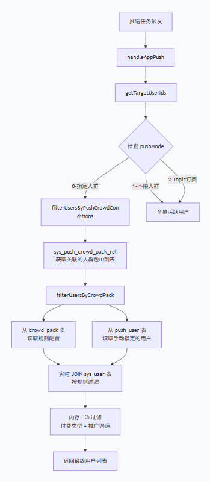

# 组件

### FCM：推送服务

Firebase Cloud Messaging (FCM) 是 Google 提供的一项跨平台消息推送服务，可以理解为连接你的后端服务器和用户手机之间的一个"
消息快递员"。

在后台管理系统中配置好推送任务（如你之前看到的 AddSysPushDTO）并存入数据库后，定时任务会扫描并触发推送。但你的服务器无法直接把消息塞进用户的手机，这时就需要
FCM 这个"官方快递通道"了。

工作原理大致是：你的应用服务器（也就是你们后端的Java服务）将消息请求发给FCM的后端服务，FCM再通过专门针对Android、iOS或Web的平台级传输层（比如Android是借助Google
Play服务）把消息可靠地送达用户设备上的应用。

💡 关键特性

1. 跨平台支持：它能向 Android、iOS 和 Web 应用都发送通知，不用为每个平台单独对接不同的推送服务（比如iOS的APNs），FCM在底层帮你处理了这些差异。

2. 灵活的消息类型：支持两种主要消息：

- 通知消息：由FCM SDK自动处理并显示在系统通知栏里，即使App在后台也能展示出来。

- 数据消息：完全由你自己的客户端代码来处理，可以用来实现更复杂的逻辑，比如静默刷新数据。

3. 多样的目标方式：可以精确地将消息发送给：

- 单一设备：通过注册令牌，发给特定用户。

- 设备组：发给一组设备。

- 主题(Topic)：所有订阅了某个"主题"（比如"科技新闻"）的设备都会收到，很适合做群发。

### 角色

```text
┌─────────────────────────────────────────────────────────────┐
│  业务层（运营/后台）                                        │
│  - 创建推送任务（sys_push）                                 │
│  - 选择人群（push_user）                                    │
│  - 配置内容和时间                                           │
└──────────────────────────┬──────────────────────────────────┘
                           │
┌──────────────────────────▼──────────────────────────────────┐
│  调度层（定时任务）                                         │
│  - XXL-Job 扫描到期任务                                     │
│  - 组装推送数据（PushMsgDTO）                               │
│  - 决定走 Token 精准推送 还是 Topic 广播                    │
└──────────────────────────┬──────────────────────────────────┘
                           │
┌──────────────────────────▼──────────────────────────────────┐
│  🔥 执行层（FCM） ← 就是你问的这个                         │
│  - 接收后端发来的消息 + Token/Topic                         │
│  - 调用 Google FCM 服务端 API                               │
│  - 通过 Google 的底层通道推送到设备                         │
└──────────────────────────┬──────────────────────────────────┘
                           │
                           ▼
                   用户手机上的 App
```

### 用户FCM token

客户端 App 因为集成了 FCM SDK，所以会自动从 Google 服务器那里领到一个“身份证号”（即 FCM Token）。然后 App
必须马上把这个号码主动上报给咱们的后端（就是你看到的 /app/token 接口），后端存进 user_device 表里。这样，后端以后才知道“消息要发给哪个手机”。

拆解成两步走（客户端视角）
第 1 步：客户端去“领号”

- App 启动时，内置的 FCM SDK 会自动向 Google 的 FCM 服务器发起请求。

- Google 服务器校验通过后，会返回一个 Token（就是一长串随机字母和数字，比如 cPTw2Y5nR...）。

这个 Token 就是这台手机上的这个 App 的唯一收件地址。

第 2 步：客户端主动“报号” （对应你看到的那个接口）

- App 拿到 Token 后，必须调用你们后端的接口：POST /app/token

- 把 Token 连同 deviceId（设备ID）、deviceSys（是安卓还是苹果）一起传过去。

后端收到后，执行 PushTokenServiceImpl.getToken() 方法，把这个 Token 存到 user_device 表里，和当前登录的 user_id 绑定。

## 语言隔离

语言（LangId）和 FCM Topic 是一对一的绑定关系。getTopics 接口的作用，就是根据用户当前使用的语言，把对应的 FCM Topic
名称返回给客户端，让客户端去订阅。

业务场景：这是一款多语言版本的短剧/视频App（面向全球用户，比如东南亚、欧美）。

运营人员发推送时，不可能用中文推给英语用户，也不可能用英语推给泰国用户。所以系统设计了 "语言隔离" 机制：

- 不同语言的用户，收到的推送内容语言不同。
- 实现方式：每种语言对应一个独立的 FCM Topic（比如 topic_zh、topic_en、topic_th）。

### 实现思路

每个sys_push 记录对应一个 subscribe_topic_id 字段， 这个字段对应一个 字典表：（dict_topic = "SUBSCRIPTION_TOPIC"）
获取这个字典的name 比如：（SarosTv_CN-31 SarosTv_JP-31 ） 这个就是FCM topic

用户的 langId (语言ID) == 字典表的 dict_value ==> 对应的 dict_name 就是 FCM Topic 名称。


### FCM 需要用户手动开启通知

在Android上，FCM要正常工作，确实要求用户开启通知权限，但这两种“开启”的含义不同，有细微差别。


1. 权限层面：系统级开关是基础
   用户需要在手机系统设置里，为你的App打开“允许通知”这个总开关。这就像是房间里电灯的总闸，如果总闸是关的，灯怎么都不会亮。

Android 13+：这个开关需要通过代码主动申请POST_NOTIFICATIONS权限才能生效。

Android 13以下：App安装后默认就有这个权限，无需显式申请。

2. FCM消息层面：权限缺失后的实际表现
   即便用户没有开启通知权限，FCM的不同消息类型表现也完全不一样，这里区别最大。

① 通知消息（Notification Message）

特点：由FCM SDK自动处理，在系统通知栏显示标题、内容等预设信息。

权限关闭后的表现：消息会直接丢失。FCM的SDK会把消息交给系统通知栏，而系统发现权限关闭，就会直接丢弃消息。你的App代码完全收不到任何回调。

② 数据消息（Data Message）

特点：只包含自定义键值对，需要App自己的代码来处理，SDK不会自动展示。

权限关闭后的表现：App在前台时，可以收到消息。因为这时App正在运行，可以直接接收数据。

但是：App在后台时，如果通知权限关闭，则无法唤醒App。FCM需要借助系统通知栏来唤醒后台应用处理数据，权限关闭后，唤醒机制失效，消息也就无法送达了。

结论：为什么“未开启”约等于“无法收到”
虽然“数据消息”在App前台时有机会收到，但用户杀进程、系统休眠等场景都依赖后台唤醒，而唤醒又高度依赖通知权限。因此，对绝大多数推送场景来说，一旦用户关闭通知权限，FCM推送基本就等于失效


#### 解决方法
可以在应用里面添加一个收件箱， 利用FCM sdk 推送是一个方式， 如果用户关闭了通知权限，也可以通过这个收件箱来接收消息，然后在后台处理数据。


# xxl-job 定时任务推送

```text
┌─────────────────────────────────────────────────────────────┐
│                    push() 主流程                            │
├─────────────────────────────────────────────────────────────┤
│  1. 获取当前时间 now 和 now+5分钟                           │
│  2. 查询所有启用的推送规则 (getUsableList)                  │
│  3. 按时间窗口筛选 → 只保留 sign 和 drama 类型              │
│  4. 遍历每条规则：                                          │
│     ├── 4.1 语言校验（短剧语言 vs Topic语言）               │
│     ├── 4.2 查 push_user 表                                │
│     │      ├── 有绑定用户 → pushByTokens（精准推送）        │
│     │      └── 无绑定用户 → pushByTopic（广播推送）         │
│     └── 4.3 统计成功/失败数量                               │
│  5. 输出最终统计日志                                        │
└─────────────────────────────────────────────────────────────┘
```

根据token推送

```text
┌─────────────────────────────────────────────────────────────┐
│                   pushByTokens                              │
├─────────────────────────────────────────────────────────────┤
│  1. 从 push_user 取出所有 userId                            │
│  2. 筛选用户：只保留 langId == sysPush.langId 的用户        │
│     如果结果为 0 → 抛出异常，跳过该推送任务                  │
│  3. 根据筛选后的 userIds 查 user_device 表获取 Token       │
│     如果查不到任何 Token → 抛出异常，跳过该推送任务          │
│  4. 组装 PushMsgDTO                                        │
│     - title, msg, type                                     │
│     - appoint/drama 类型额外携带 playId, seriesId          │
│     - 所有类型携带 indexType（跳转页面）                    │
│     - tokens 列表                                          │
│  5. 调用 fireBaseService.push(dto)                         │
│  6. 返回成功/失败数量                                       │
└─────────────────────────────────────────────────────────────┘
```

根据Topic推送

不需要查 user_device 表，FCM 服务端自己维护订阅列表

不需要做语言过滤，因为 Topic 本身已经按语言分好了

```text
┌─────────────────────────────────────────────────────────────┐
│                   pushByTopic                               │
├─────────────────────────────────────────────────────────────┤
│  1. 组装 PushMsgDTO                                        │
│     - title, msg, type                                     │
│     - appoint/drama 类型额外携带 playId, seriesId          │
│     - 所有类型携带 indexType                                │
│  2. 根据 subscriptionTopicId 查字典表                       │
│  3. 取出 dict_name 作为 FCM Topic 名称                     │
│     （比如 SarosTv_US-31）                                 │
│  4. 调用 fireBaseService.push(dto)                         │
│     → FCM 自动推给所有订阅了该 Topic 的设备                │
│  5. 返回 true/false                                        │
└─────────────────────────────────────────────────────────────┘
```

# 字典

id dict_topic dict_name dict_value dict_desc

147,SUBSCRIPTION_TOPIC,SarosTv_CN-31,1,中文
148,SUBSCRIPTION_TOPIC,SarosTv_US-31,2,英语
149,SUBSCRIPTION_TOPIC,SarosTv_KR-31,4,韩语
150,SUBSCRIPTION_TOPIC,SarosTv_JP-31,5,日语
151,SUBSCRIPTION_TOPIC,SarosTv_ES-31,7,西语
152,SUBSCRIPTION_TOPIC,SarosTv_TH-31,8,泰语
153,SUBSCRIPTION_TOPIC,SarosTv_HK-31,9,繁中
154,SUBSCRIPTION_TOPIC,SarosTv_ID-31,10,印尼
155,SUBSCRIPTION_TOPIC,SarosTv_PT-31,11,葡语
156,SUBSCRIPTION_TOPIC,SarosTv_TR-31,12,土耳其
157,SUBSCRIPTION_TOPIC,SarosTv_FR-31,13,法语
158,SUBSCRIPTION_TOPIC,SarosTv_AE-31,14,阿拉伯
159,SUBSCRIPTION_TOPIC,SarosTv_DE-31,15,德语
300,SUBSCRIPTION_TOPIC,SarosTv_VN-31,17,越南语

# AWS SES

它的大名是 Amazon Simple Email Service，是亚马逊云（AWS）提供的一项云服务。可以把它理解成一个专门用来发邮件的、可靠且便宜的“云上邮局”，你可以通过调用它的
API 或 SMTP 接口来发送邮件。

# dev分支推送代码

## 二、整体架构

```
┌──────────────────────────────────────────────────────────────────────┐
│                        后台管理 (PushMsgController)                    │
│  推送配置 CRUD + 人群包管理 (CrowdPackController) + 站内信查询         │
└──────────────────────────────┬───────────────────────────────────────┘
                               │
┌──────────────────────────────▼───────────────────────────────────────┐
│                     定时调度 (TimerHandler / XXL-Job)                  │
│  ┌─────────────────┐    ┌─────────────────┐                         │
│  │ push (App推送)   │    │ emailPush (邮件) │                         │
│  └────────┬────────┘    └────────┬────────┘                         │
└───────────┼──────────────────────┼──────────────────────────────────┘
            │                      │
┌───────────▼──────────┐  ┌───────▼───────────────────────────────────┐
│  Firebase (FCM)       │  │  AWS SES (邮件)                          │
│  Token精准 / Topic广播 │  │  SQS → Consumer → SES → email_send_log  │
└───────────────────────┘  └──────────────────────────────────────────┘
            │
┌───────────▼──────────────────────────────────────────────────────────┐
│  站内信 (station_letter) — 每次推送自动生成，APP端可查询/标记已读      │
└──────────────────────────────────────────────────────────────────────┘
```

# push逻辑



### 实时计算逻辑

根据人群包规则，实时计算出需要推送的用户列表

层级 过滤维度 实现方式 说明

第一层 活跃时间 SQL 条件 last_login_time >= 阈值 或 create_time >= 阈值

第二层 人群包规则 SQL 条件 国家、语言、注册时间、设备、VIP 状态（直接查 sys_user）

第三层 手动指定用户 SQL 条件 从 push_user 表读取，跳过所有人群包规则校验（第69-71行）

第四层 付费类型 内存过滤 无法用单表 SQL 完成，需查 sys_order 表判断

第五层 推广渠道 内存过滤 无法用单表 SQL 完成，需查 event_link_coloration 表判断

# 后端和app 推送方式

1. 后端推送到app
2. app 轮询每次请求后端获取数据

sys_push (FCM/邮件)          activity_push_* (入口展示)

───────────────────── ──────────────────────────

触发方式: XXL-Job 定时 触发方式: APP 请求时实时计算

推送到:   手机通知栏/邮箱 展示在:   APP 内部 UI 元素

技术:     Firebase FCM / SES 技术:     REST API 返回配置

目标:     通过人群包/Topic 目标:     通过人群包 + 频控 + AB实验

记录:     station_letter 记录:     activity_push_history

系统弹窗和活动等都是依靠app 主动拉去数据，而不是后台主动推送。这样可以减少服务器压力，提高响应速度。

消息等通知是利用app 即使推送的

### 弹窗功能的实现

```text
APP 用户执行操作 (进入首页/打开播放页/关闭支付面板...)
    │
    ▼
POST /app/popup  {position, triggerTiming, playId, seriesId, storeCountryCode, playSecondTime}
    │
    ▼
AppPopupServiceImpl.getCurrentUserNeedShowPopupListV2()
    │
    ├── 1. AB 实验检查
    │      ├── enablePopupPush=false → 直接返回 showOldPopup=true，不弹窗
    │      └── 实验组有指定 popupRuleId → 直接用实验规则，跳过正常匹配
    │
    ├── 2. 三路并行查询候选规则:
    │      ├── (a) popup_target_rule (targetType=ALL) → 测试规则，面向所有用户
    │      ├── (b) popup_target_rule (targetType=USER) → 指定用户的测试规则
    │      └── (c) popup_rule (is_experiment=false) → 正式规则
    │           SQL 条件: position + triggerTiming + 国家 + 语言 + 设备系统
    │
    ├── 3. 人群包匹配 (crowd_limit=0 时)
    │      └── popup_rule_crowd → crowd_pack → filterMatchedCrowdPack()
    │
    ├── 4. 观看时长过滤 (watchingDurationType)
    │      └── 比较 playSecondTime 与 durationMin/Max
    │
    ├── 5. 每日频控 (查 popup_user_history 今日记录)
    │      └── 已展示次数 >= popupCount → 排除
    │
    ├── 6. 加载弹窗配置 (popup 表)
    │      └── 校验状态/设备系统/构建弹窗内容 (折扣/推荐/自定义)
    │
    ├── 7. 轮询选择 (每次只返回 1 个弹窗)
    │      └── 查上次展示的弹窗 → 按优先级取下一个 (循环轮转)
    │
    ├── 8. ★ 写入 popup_user_history (记录本次展示)
    │
    └── 9. 返回 AppPopupVO → APP 渲染弹窗
```

### 系统三种消息推送方式

简单说：

- sys_push = "我主动发消息到你手机通知栏"
- activity_push = "你打开 APP 时，我决定展示哪个活动入口按钮"
- popup_rule = "你在 APP 里操作时，我决定弹不弹窗、弹什么"

| 对比维度      | sys_push (FCM / 邮件) | activity_push_* (活动入口) | popup_rule (弹窗)           |
|-----------|---------------------|------------------------|---------------------------|
| 触发方式      | XXL-Job 定时          | APP 请求时实时              | APP 请求时实时                 |
| 推送 / 展示位置 | 手机通知栏 / 邮箱          | APP 内浮动按钮 / 角标         | APP 内弹窗                   |
| 频控规则      | 无 (一次触发全推)          | 每日触发次数                 | 每日弹窗次数                    |
| 定向能力      | 人群包 / Topic         | 人群包 + AB 实验            | 人群包 + 国家 / 语言 / 设备 / 观看时长 |
| 轮询机制      | 无                   | 无 (取最高优先级)             | 有 (按优先级轮转)                |
| 记录存储      | station_letter      | activity_push_history  | popup_user_history        |

# 后台管理系统协作图

```text
【步骤1】运营人员在"人群包设置"中创建人群
                ↓
        crowd_pack (人群包定义)
        - name: "高活跃付费用户"
        - vip_user: true
        - watch_duration_min: 3600
        - country_codes: ["US","UK"]
                ↓
【步骤2】运营人员在"弹窗配置"中创建弹窗内容
                ↓
        popup (弹窗主表)
        - popup_name: "VIP续费优惠弹窗"
        - popup_type: 1 (折扣弹窗)
        - goods_id: 关联付费项
        - popup_file_id: 弹窗图片
                ↓
【步骤3】运营人员创建弹窗规则，关联弹窗和人群包
                ↓
        popup_rule (弹窗规则表)
        - popup_rule_name: "VIP用户续费挽留规则"
        - popup_id: 关联 popup 表
        - trigger_type: 2 (退出充值礼包)
        - position: 3 (PLAYER页面)
        - trigger_timing: 4 (CLOSE_PAYMENT)
        - watching_duration_type: 1 (大于等于)
        - duration_min: 300 (看剧≥5分钟)
        - priority: 10
                ↓
        popup_rule_crowd (规则-人群包中间表)
        - popup_rule_id: 关联 popup_rule
        - crowd_id: 关联 crowd_pack
                ↓
【步骤4】用户触发行为时，系统匹配规则并推送弹窗
                ↓
        popup_user_history (弹窗用户历史)
        - 记录谁在什么时间看到了什么弹窗
```

```text
┌─────────────────────────────────────────────────────────────────────────────┐
│                          运营配置阶段                                       │
├─────────────────────────────────────────────────────────────────────────────┤
│                                                                             │
│  人群包设置                          弹窗配置                               │
│  ┌──────────────┐                  ┌──────────────┐                       │
│  │ crowd_pack   │                  │   popup      │                       │
│  │ - 人群名称    │                  │ - 弹窗名称    │                       │
│  │ - 筛选条件    │                  │ - 弹窗样式    │                       │
│  │ - 国家/语言   │                  │ - 图片/文案   │                       │
│  └──────┬───────┘                  └──────┬───────┘                       │
│         │                                  │                               │
│         │      ┌───────────────────────────┘                               │
│         │      │                                                           │
│         ▼      ▼                                                           │
│  ┌──────────────────────────────────────────┐                              │
│  │              popup_rule                  │                              │
│  │  弹窗规则表（将两者关联）                 │                              │
│  │  - 触发类型 (trigger_type)              │                              │
│  │  - 触发页面 (position)                  │                              │
│  │  - 触发操作 (trigger_timing)            │                              │
│  │  - 观看时长条件 (duration)              │                              │
│  │  - 优先级 (priority)                    │                              │
│  └──────────────────────────────────────────┘                              │
│                    │                                                        │
│                    ▼                                                        │
│  ┌──────────────────────────────────────────┐                              │
│  │        popup_rule_crowd (中间表)        │                              │
│  │     把规则和人群包绑定在一起              │                              │
│  └──────────────────────────────────────────┘                              │
│                                                                             │
└─────────────────────────────────────────────────────────────────────────────┘

                                    │
                                    ▼

┌─────────────────────────────────────────────────────────────────────────────┐
│                          用户运行时阶段                                     │
├─────────────────────────────────────────────────────────────────────────────┤
│                                                                             │
│  用户行为触发                                                               │
│  ┌──────────────────────────────────────────┐                              │
│  │  用户进入播放页 / 关闭支付 / 退出APP     │                              │
│  └──────────────────────────────────────────┘                              │
│                    │                                                        │
│                    ▼                                                        │
│  ┌──────────────────────────────────────────┐                              │
│  │  系统匹配规则                             │                              │
│  │  1. 查询当前用户属于哪些人群包            │                              │
│  │  2. 匹配触发类型 + 页面 + 操作           │                              │
│  │  3. 判断观看时长是否满足条件              │                              │
│  │  4. 按优先级排序                         │                              │
│  └──────────────────────────────────────────┘                              │
│                    │                                                        │
│                    ▼                                                        │
│  ┌──────────────────────────────────────────┐                              │
│  │  推送弹窗给用户                          │                              │
│  │  - 返回 popup 中的弹窗内容               │                              │
│  │  - 记录 popup_user_history               │                              │
│  └──────────────────────────────────────────┘                              │
│                                                                             │
└─────────────────────────────────────────────────────────────────────────────┘
```


# 短剧
```text
最大层级：剧场（theater）
    │
    ├── 短剧A（play）
    │       ├── 剧集1（play_series）
    │       ├── 剧集2（play_series）
    │       └── ...
    │
    ├── 短剧B（play）
    │       ├── 剧集1（play_series）
    │       └── ...
    │
    └── 短剧C（play）
            └── 剧集1（play_series）
```


## 数据库关系
```text

┌─────────────────────────────────────────────────────────────────────────────────────┐
│                         剧场与短剧完整关系图                                         │
├─────────────────────────────────────────────────────────────────────────────────────┤
│                                                                                     │
│  ┌─────────────────────────────────────────────────────────────────────────────┐    │
│  │                            剧场域 (Theater Domain)                          │    │
│  ├─────────────────────────────────────────────────────────────────────────────┤    │
│  │                                                                             │    │
│  │  ┌─────────────────────────────────────────────────────────────────────┐    │    │
│  │  │                         theater (剧场表)                            │    │    │
│  │  │  - id: 主键                                                         │    │    │
│  │  │  - theater_name: 剧场名称 (如"悬疑剧场")                             │    │    │
│  │  │  - theater_status: 状态 (开启/关闭)                                  │    │    │
│  │  │  - lang_id: 语言ID → sys_lang.id                                   │    │    │
│  │  │  - sort: 排序                                                       │    │    │
│  │  └────────────────────────────┬────────────────────────────────────────┘    │    │
│  │                               │                                             │    │
│  │                               │ 1:N (theater_id)                           │    │
│  │                               ▼                                             │    │
│  │  ┌─────────────────────────────────────────────────────────────────────┐    │    │
│  │  │                      theater_play (中间表)                          │    │    │
│  │  │  - id: 主键                                                         │    │    │
│  │  │  - theater_id: 剧场ID → theater.id                                  │    │    │
│  │  │  - play_id: 短剧ID → play.id                                       │    │    │
│  │  │  - sort: 剧场内的排序                                                │    │    │
│  │  └────────────────────────────┬────────────────────────────────────────┘    │    │
│  │                               │                                             │    │
│  └───────────────────────────────┼─────────────────────────────────────────────┘    │
│                                  │                                                  │
│                                  │ play_id                                          │
│                                  ▼                                                  │
│  ┌─────────────────────────────────────────────────────────────────────────────┐    │
│  │                         短剧域 (Play Domain)                                │    │
│  ├─────────────────────────────────────────────────────────────────────────────┤    │
│  │                                                                             │    │
│  │  ┌─────────────────────────────────────────────────────────────────────┐    │    │
│  │  │                       parent_play (主剧表)                           │    │    │
│  │  │  - id: 主键                                                         │    │    │
│  │  │  - play_name: 主剧名称                                              │    │    │
│  │  │  - production_type: 剧目类型 (自制/外采/翻译等)                      │    │    │
│  │  │  - file_id: 封面图                                                   │    │    │
│  │  │  - play_status: 状态 (默认/完结)                                    │    │    │
│  │  │  - play_total: 总集数                                               │    │    │
│  │  └────────────────────────────┬────────────────────────────────────────┘    │    │
│  │                               │                                             │    │
│  │                               │ 1:N (parent_play_id)                       │    │
│  │                               ▼                                             │    │
│  │  ┌─────────────────────────────────────────────────────────────────────┐    │    │
│  │  │                          play (短剧表) ★核心表                      │    │    │
│  │  │  - id: 主键                                                         │    │    │
│  │  │  - play_name: 短剧名称                                              │    │    │
│  │  │  - chinese_name: 中文名称                                           │    │    │
│  │  │  - parent_play_id: 主剧ID → parent_play.id                         │    │    │
│  │  │  - file_id: 封面图文件ID                                            │    │    │
│  │  │  - compressed_file_id: 压缩封面图ID                                │    │    │
│  │  │  - play_desc: 推荐语                                                │    │    │
│  │  │  - play_status: 状态 (默认/完结)                                    │    │    │
│  │  │  - play_release: 是否发布 (0否/1是)                                │    │    │
│  │  │  - play_total: 总集数                                               │    │    │
│  │  │  - play_track_num: 收藏人数                                         │    │    │
│  │  │  - real_track_num: 真实收藏人数                                     │    │    │
│  │  │  - play_ads_unlock_num: 广告解锁集数                               │    │    │
│  │  │  - play_web_unlock: Web可看集数                                    │    │    │
│  │  │  - display_type_tag: 是否显示分类标签                              │    │    │
│  │  │  - play_sort: 排序                                                  │    │    │
│  │  │  - subscript: 角标 (0 Hot / 1 New)                                │    │    │
│  │  │  - lang_id: 语言ID → sys_lang.id                                  │    │    │
│  │  │  - series_price: 单集默认价格                                      │    │    │
│  │  │  - production_type: 剧类型                                          │    │    │
│  │  │  - minis_play_release: 小程序是否发布                              │    │    │
│  │  │  - minis_play_release_time: 小程序发布时间                         │    │    │
│  │  │  - external_release: 是否发布给外部                                │    │    │
│  │  │  - external_release_time: 外部发布时间                             │    │    │
│  │  └───┬──────┬──────┬──────┬──────┬──────┬──────┬──────┬─────────────┘    │    │
│  │      │      │      │      │      │      │      │                          │    │
│  │      │ 1:N  │ 1:N  │ 1:N  │ 1:N  │ 1:N  │ 1:N  │                          │    │
│  │      ▼      ▼      ▼      ▼      ▼      ▼      ▼                          │    │
│  │  ┌──────┐┌──────┐┌──────┐┌──────┐┌──────┐┌──────┐┌──────────────────┐   │    │
│  │  │play_ ││play_ ││play_ ││play_ ││play_ ││play_ ││   user_unlock_   │   │    │
│  │  │series││tag   ││type  ││unlock││sched ││promo ││     play         │   │    │
│  │  │(剧集)││(中间)││(中间)││_type ││_relea││_cover││  (用户解锁短剧)   │   │    │
│  │  └──┬───┘└──┬───┘└──┬───┘└──┬───┘└──se──┘└──┬───┘└────────┬─────────┘   │    │
│  │     │       │       │       │       │       │              │              │    │
│  │     │ 1:N   ▼       ▼       │       ▼       ▼              ▼              │    │
│  │     ▼   ┌──────┐┌──────┐   │   ┌─────────────────────────┐  ┌──────────┐  │    │
│  │  ┌──────┐│sys_  ││sys_  │   │   │play_scheduled_release  │  │ user_un- │  │    │
│  │  │play_ ││tag   ││type  │   │   │   (定时发布)            │  │ lock_ser │  │    │
│  │  │history│(标签)│(类型) │   │   └─────────────────────────┘  │  (解锁集) │  │    │
│  │  │(播放 │└──────┘└──────┘   │                               └──────────┘  │    │
│  │  │ 历史)│                     │                               │              │    │
│  │  └──────┘                     │                               ▼              │    │
│  │     │                         │      ┌─────────────────────────────────┐    │    │
│  │     ▼                         │      │     user_track (用户追剧)       │    │    │
│  │  ┌────────────────────────────┐│      │  - user_id → sys_user.id       │    │    │
│  │  │   user_ads (用户广告观看)   ││      │  - play_id → play.id           │    │    │
│  │  └────────────────────────────┘│      └─────────────────────────────────┘    │    │
│  │     │                         │                    │                         │    │
│  │     │                         │                    ▼                         │    │
│  │     │                         │      ┌─────────────────────────────────┐    │    │
│  │     │                         │      │    user_unlock_play (解锁短剧)  │    │    │
│  │     │                         │      │  - user_id → sys_user.id       │    │    │
│  │     │                         │      │  - play_id → play.id           │    │    │
│  │     │                         │      └─────────────────────────────────┘    │    │
│  │     │                         │                    │                         │    │
│  │     │                         │                    │ 1:N                     │    │
│  │     │                         │                    ▼                         │    │
│  │     │                         │      ┌─────────────────────────────────┐    │    │
│  │     │                         │      │   user_unlock_series (解锁集)   │    │    │
│  │     │                         │      │  - unlock_play_id (关联上表)    │    │    │
│  │     │                         │      │  - series_id → play_series.id   │    │    │
│  │     │                         │      └─────────────────────────────────┘    │    │
│  │     │                         │                                              │    │
│  └─────┼─────────────────────────┼──────────────────────────────────────────────┘    │
│        │                         │                                                    │
│        │ N:M                     │ N:M                                                │
│        ▼                         ▼                                                    │
│  ┌─────────────────────────────────────────────────────────────────────────────┐    │
│  │                         关联维度表                                           │    │
│  ├─────────────────────────────────────────────────────────────────────────────┤    │
│  │                                                                             │    │
│  │  ┌─────────┐  ┌─────────┐  ┌─────────┐  ┌─────────┐  ┌─────────────────┐  │    │
│  │  │ sys_user │  │ sys_lang│  │ sys_file│  │recommend│  │  tt_minis_play  │  │    │
│  │  │  (用户)  │  │  (语言) │  │  (文件) │  │  (推荐) │  │   _minis_rel    │  │    │
│  │  └─────────┘  └─────────┘  └─────────┘  └─────────┘  │  (小程序关联)   │  │    │
│  │                                                                             │    │
│  └─────────────────────────────────────────────────────────────────────────────┘    │
│                                                                                     │
└─────────────────────────────────────────────────────────────────────────────────────┘
```


##  短剧相关表及关系详解

### 一、剧场相关表 (Theater)

| 表名 | 字段 | 说明 |
|------|------|------|
| theater | id, theater_name, theater_status, lang_id, sort | 剧场主表 |
| theater_play | id, theater_id, play_id, sort | 剧场 ↔ 短剧 多对多中间表 |

### 二、短剧内容表 (Play Content)

| 层级 | 表名 | 关联字段 | 说明 |
|------|------|----------|------|
| 主剧 | parent_play | - | 母剧/主剧，最顶层 |
| 子剧 | play | parent_play_id → parent_play.id | 具体短剧，核心表 |
| 剧集 | play_series | play_id → play.id | 每集内容 |
| 解锁配置 | play_unlock_type | play_id → play.id | 短剧解锁方式配置 |
| 定时发布 | play_scheduled_release | play_id → play.id | 短剧定时发布 |
| 推广封面 | play_promotion_cover | play_id → play.id | 短剧推广封面 |

### 三、分类维度表（多对多，通过中间表）

| 维度 | 中间表 | 关联字段 | 说明 |
|------|--------|----------|------|
| 标签 | play_tag | play_id + tag_id → sys_tag | 短剧标签 |
| 类型 | play_type | play_id + type_id → sys_type | 短剧类型 |
| 剧场 | theater_play | play_id + theater_id → theater | 短剧所属剧场 |
| 推荐 | recommend_play | play_id + recommend_id → recommend | 短剧推荐配置 |

### 四、用户相关表 (User ↔ Play)

| 表名 | 关联字段 | 说明 |
|------|----------|------|
| user_track | user_id + play_id | 用户追剧（多对多中间表） |
| user_unlock_play | user_id + play_id | 用户解锁的短剧 |
| user_unlock_series | unlock_play_id + series_id | 用户解锁的具体剧集 |
| play_history | user_id + play_id + series_id | 用户播放历史 |
| user_ads | user_id + play_id | 用户广告观看记录 |
| auto_unlock | user_id + play_id | 用户自动解锁配置 |
| user_link_id_bind | user_id + play_id | 用户落地页绑定 |

### 五、其他关联表

| 表名 | 关联字段 | 说明 |
|------|----------|------|
| sys_lang | play.lang_id | 语言 |
| sys_file | play.file_id | 封面图文件 |
| video_download_record | play_id | 视频下载记录 |
| tt_minis_play_minis_rel | play_id + minis_id | TikTok 小程序关联 |
| sys_order | play_id + series_id | 订单关联 |
| popup | play_id | 弹窗关联 |


### 层级

```text

1. 最大层级：parent_play (主剧)
   └── 包含多个 play (子剧)
        ├── 关联 theater (剧场) — 通过 theater_play
        ├── 关联 sys_tag (标签) — 通过 play_tag
        ├── 关联 sys_type (类型) — 通过 play_type
        ├── 关联 recommend (推荐) — 通过 recommend_play
        └── 包含多个 play_series (剧集)
             ├── 被用户解锁 (user_unlock_series)
             ├── 被用户播放 (play_history)
             └── 被订单关联 (sys_order)
             
```


